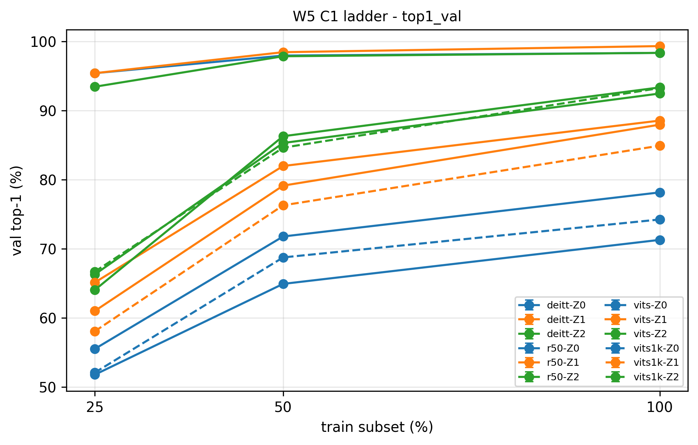

# 从手写 ViT 到迁移对照：视觉 Transformer 的小样本受控实验（Flowers-102）

**架构、预训练起点与迁移策略的受控对照** ｜ 完整实验报告：[reports/report.md](reports/report.md)

> 在 Flowers-102（官方训练集每类仅 10 张）上，把三件事放进同一个矩阵逐格测量：**backbone 换不换**（ResNet-50 / ViT-S / DeiT-Ti）、**预训练起点换不换**（ImageNet-21k+1k / 仅 1k）、**迁移策略换不换**（零训练分类 / 线性探针 / 全参微调）。42 个受控配置、四项指标逐组落盘，可复现。

**结论：在本实验条件下（Flowers-102、单一种子 seed 42、3 点启发式门槛），决定性能的主导变量是预训练起点的强弱，架构与迁移策略都是次要的。**

常被引用的「ViT 在小数据上打不过 CNN」，在本实验里只在同等预训练量下成立——冻结特征时 CNN 领先 ViT-S 3.6 至 7.1 点。而主表却给出相反的画面：ViT-S 连「不训练」那一档都有 98.33%，比 ResNet-50 全参微调高 5.0 点。这个反差来自两边预训练数据量相差 11 倍。**主表必须与起点消融表一起读，否则会被读成架构结论。**

**主结果：验证集 top-1 准确率（%）**

| 架构（预训练起点） | 迁移策略 | 25%（每类 2 张） | 50%（每类 5 张） | 100%（每类 10 张） | 种子数 |
|---|---|---|---|---|---|
| ResNet-50（1k） | 零训练分类 | 51.76 | 64.90 | 71.27 | 1 |
| ResNet-50（1k） | 线性探针 | 65.10 | 81.96 | 88.53 | 1 |
| ResNet-50（1k） | 全参微调 | 64.02 | 86.27 | 93.33 | 1 |
| ViT-S（21k+1k） | 零训练分类 | 95.39 | 97.94 | 98.33 | 1 |
| ViT-S（21k+1k） | 线性探针 | 95.39 | 98.43 | 99.31 | 1 |
| ViT-S（21k+1k） | 全参微调 | 93.43 | 97.84 | 98.33 | 1 |
| ViT-S（仅 1k） | 零训练分类 | 52.06 | 68.73 | 74.22 | 1 |
| ViT-S（仅 1k） | 线性探针 | 58.04 | 76.27 | 84.90 | 1 |
| ViT-S（仅 1k） | 全参微调 | 66.67 | 84.61 | 93.24 | 1 |
| DeiT-Ti（1k） | 零训练分类 | 55.49 | 71.76 | 78.14 | 1 |
| DeiT-Ti（1k） | 线性探针 | 60.98 | 79.12 | 87.94 | 1 |
| DeiT-Ti（1k） | 全参微调 | 66.27 | 85.29 | 92.45 | 1 |

> **读这些数字前必须知道的三件事**
> 1. 全部为**验证集**结果（1020 张，每类 10 张），**单一种子**（seed 42），**测试集从未参与任何开发决策**。
> 2. 判定用的「3 点门槛」是**启发式阈值**（约 3 倍单点噪声），不是统计检验。
> 3. 分数差异低于门槛的条目，正确读法是「无法与噪声区分」，不是「已经证明相等」。



*四个子图 = 四个架构（左上 ResNet-50、右上 ViT-S（21k+1k）、左下 ViT-S（仅 1k）、右下 DeiT-Ti），每个子图内三条线 = 三种迁移策略（蓝 = 零训练分类、橙 = 线性探针、绿 = 全参微调）；横轴 = 训练子集档位（25 / 50 / 100%，即每类 2 / 5 / 10 张），纵轴 = 验证集 top-1。**四个子图的纵轴各自缩放，只能在同一子图内比三条线的高低。** 右上子图三条线几乎重合（线距不到 2 点），另外三个子图同一档位的线距是 10 至 22 点；左上与左下是同等预训练量下的对照，橙线在左下更低、绿线在 50% 档就反超，而右上子图全程几乎平——决定结果的既不是架构也不是策略，是起点。与 top-1 近乎等价的 macro-F1 阶梯图见 `figures/F1_ladder_2_macro_f1_val.png`。*

---

## 四条核心发现

**① 预训练量的价值随数据缩减单调放大，且「不训练」那一档受影响最大。**

固定同一个 ViT-S 架构、同一种迁移策略、同一个数据档，**只把预训练起点从「仅 1k」换成「21k+1k」**，验证集 top-1 的差值如下（**数值 = 21k+1k 起点 − 仅 1k 起点，单位百分点，正 = 充分预训练更优**）：

| 迁移策略 | 25% 档 | 50% 档 | 100% 档 |
|---|---|---|---|
| 零训练分类（纯特征） | **+43.33** | +29.21 | +24.11 |
| 线性探针 | +37.35 | +22.16 | +14.41 |
| 全参微调 | +26.76 | +13.23 | +5.09 |

三种策略全部单调（例：25% 档零训练分类 = 95.39 − 52.06 = **+43.33**）。其中零训练档的差值最大而不是最小——它不做任何优化，分类完全建立在预训练特征上，起点是它唯一的输入。**「不训练」不等于「不吃权重」。**

**② 「策略怎么选都差不多」是强预训练起点的性质，不是 ViT 架构的性质。**

同一个 ViT-S，只把起点从 21k 换成 1k，同一数据档内三种策略的极差就从 2 点以内跳到 14.6 至 19.0 点，与 ResNet-50（13.3 至 22.1 点）、DeiT-Ti（10.8 至 14.3 点）同量级。准确的说法是：**21k 特征强到让下游怎么训都无所谓。**

**③ 同等预训练量下，卷积网络的冻结特征优于 ViT。**

线性探针档（只训一个线性头）ViT-S 相对 ResNet-50 三档为 **−3.63 / −5.69 / −7.06**（Δ = ViT-S − ResNet-50），全部超过门槛。但在全参微调档，三者挤进 ±2.7 点内——**解冻即抹平架构差异**。这条是全文因果链最干净的一组。

**④ 全参微调划不划算，由起点强度决定，不由数据量决定。**

| 架构（起点强度） | 25% | 50% | 100% |
|---|---|---|---|
| ViT-S（仅 1k） | +8.63 | +8.34 | +8.34 |
| DeiT-Ti（1k） | +5.29 | +6.17 | +4.51 |
| ResNet-50（1k） | −1.08 | +4.31 | +4.80 |
| ViT-S（21k+1k） | −1.96 | −0.59 | −0.98 |

（数值 = 全参微调减线性探针，正 = 全参微调更好）起点越弱越该解冻；起点足够强时解冻略有小亏（幅度不过门槛，属「待确认」）。

**一条负结果**：蒸馏与强增强的 2×2 消融（固定 DeiT-Ti + 全参微调）四个差值全部落在 ±3.6 点内，唯一过门槛的一项是 25% 档「强增强、无教师」的 **−3.62**。其中「基础增强下蒸馏效应约为 0」是**可事先推导的结构性结果**（教师模型在该增强视图上准确率仍有 95.70%，硬标签与真标签几乎相同；该数为单批 256 张估计），不能写成「基础增强下蒸馏没用」。详见报告第 3.5 节。

---

## 这份实验在方法上的几处刻意安排

| 安排 | 具体做法 | 为什么 |
|---|---|---|
| **命题开跑前预登记** | 6 条待检验命题在跑矩阵之前写下，写进文档 | 防止事后解释数据；判定结果与命题一一对应 |
| **测试集只碰一次** | 开发期全部数字来自验证集；测试集在配置冻结前不进视野 | 一旦提前看，测试集退化成第二个验证集，独立性消失 |
| **关闭 CUDA 非确定性** | 关 cuDNN 自动调优、把 SDPA 强制到 math 后端 | 实测同一配置两次跑差 2.4 点，会直接污染误差棒 |
| **跑完回头审代码** | 矩阵跑完后逐字段反查配置的消费点，审出并修掉两处 | 见下 |
| **每个配置 27 列落盘** | 含 `git_commit` 溯源、卫生断言、资源占用、增强与蒸馏标记 | 「配置层写了」不等于「执行层接上了」 |

**回头审出的两处问题**（均已修复并实测确认影响量级）：

| 问题 | 后果 | 修复后实测 |
|---|---|---|
| 零训练档误用了随机数据增强 | 类中心混入噪声，与验证集的中心裁剪分布不匹配 | 该档三架构差 **7 至 11 点**（远超门槛） |
| DeiT 蒸馏版的分类头取错路径（取到的是双 token 的均值，不是分类 token） | 评估方式与训练不一致 | 新旧路径 logits 级差 **6.4e-01**，新路径与目标完全一致（差值 0.0） |

---

## 我做了什么

**自己实现的部分**（W1–W2，全部附与官方实现的数值对齐证据；脚本在 `test/` 下，可运行 `python test/attention_debug.py`、`python test/vit_block_debug.py` 复核）：

| 模块 | 文件 | 对齐验收 |
|---|---|---|
| 缩放点积注意力（含 dropout / causal mask） | `attention.py` | 与 `F.scaled_dot_product_attention` 对齐，无 mask 与 causal 两种场景 |
| 多头注意力（QKV 拆分 → 分头 → 拼接） | `attention.py` | 与 `nn.MultiheadAttention` 共享权重对齐，误差 **5.96e-08** |
| 正弦位置编码与可学习位置编码 | `vit.py` | 公式实现 + 频率可视化 |
| ViT 编码块（pre-LN + 残差 + MLP） | `vit.py` | 与 `timm` 的 `vit_small_patch16_224` 首个 blocks 对齐，误差 **4.71e-06** |

**工程实现**：W3 之后的实验骨架——数据管道与嵌套分层子集、配置系统、三种迁移协议的训练与评估循环、硬标签蒸馏装置、矩阵批跑与出图脚本。规格与验收标准由我设定，实现借助 AI 工具完成。

**正确性保证**：教师模型的验证准确率被要求**落在 0.9333 ± 0.001**（`distill.py` 自检断言；checkpoint 记录 0.9333，自检在验证集上重算为 0.9324，差异来自批大小与 transform 口径）——这是唯一能当场抓出「类别顺序错位」这类静默错误的检查（顺序错了不会报错，但这个数一定对不上）。

---

## 快速开始

```bash
conda activate pytorch          # torch 2.9.0+cu130，装法见「环境」
pip install -r requirements.txt

# 数据：从 http://www.robots.ox.ac.uk/~vgg/data/flowers/102/ 下载 102flowers.tgz、
#   imagelabels.mat、setid.mat，解压到 data/flowers-102/（结构：jpg/ + 两个 .mat）
#   四档子集索引已随仓库提供（subsets/tier_{10,25,50,100}.json），无需重新抽样

# 单组：架构 / 策略 / 数据档 / 种子
python run_matrix.py --arch vits --mode Z2 --data 100 --seed 42
python run_matrix.py --arch deitt --mode Z2 --data 25 --seed 42 --aug strong --distill
python run_matrix.py --arch vits --mode Z2 --data 100 --seed 42 --dry-run --no-resume   # 试跑

# 装置自检（对齐 + 契约回归）
python distill.py                # 打印 [align] 表，末行 PASS、退出码 0
python verify_w5d2.py            # 含 timm Mixup target 契约回归
python test/attention_debug.py   # 手写注意力 vs 官方
python test/vit_block_debug.py   # 手写 ViT 块 vs timm

# 出图（从 experiments.csv 读取，脚本内不写死数字）
python make_figures.py
```

**自检数字**（跑完应对得上）：教师模型验证 top-1 = 0.9333；ViT-S 零训练档 100% = 98.33、ResNet-50 全参微调 100% = 93.33；42 组合计机时 204.5 分钟，峰值显存 2.080 GB / 8 GB；参数变化断言 42 / 42 通过。

---

## 完整复现

复现三件套齐全：依赖见 `requirements.txt`（全部 `==` 钉版本）；数据获取见上节；随机种子固定为 `seed 42`（子集抽样种子同为 42、且与训练种子解耦，见报告 §7.5）。流程 = 装依赖 → 下数据 → 按报告表 2 的 42 组配置逐格 `python run_matrix.py --arch … --mode … --data … --seed 42` → `python make_figures.py` 出图，结果与本文数字逐位一致。

---

## 项目结构

```
├── README.md                    本文：快速了解项目
├── reports/report.md            完整实验报告（设计 / 结果 / 机制 / 局限）
├── attention.py vit.py          手写注意力与 ViT 编码块 —— 与官方实现差多少？
├── config.py data.py            配置源与数据管道 —— 每格配了什么、子集怎么抽？
├── protocol.py distill.py       迁移协议 + 四项指标 / 硬标签蒸馏 —— 怎么跑、怎么评？
├── run_matrix.py                矩阵批跑入口 —— 断点续跑 + 27 列溯源落盘
├── make_figures.py make_report.py  报告用图与 W4 汇总（从 csv 出图，不写死数字）
├── make_subsets.py make_env.py  一次性：落盘四档子集索引 / 环境快照
├── verify_w5d2.py plot_utils.py 装置回归校验 / 训练曲线绘制
├── run_matrix_all.ps1           PowerShell 批跑启动器（含断点续跑）
├── teacher_train.py             已废弃：W3 训练 teacher 的旧脚本（跑不通，见「已知限制」）
├── requirements.txt env.txt     钉死版本的依赖清单 / 环境快照
├── W4_notes.md                  W4 开跑前后的两处 bug 与已知局限
├── test/ notes/ subsets/        对齐校验脚本 / 周记与中间产物 / 四档子集索引
├── figures/ results/            报告用图（png + pdf）/ 逐组结果与 experiments.csv
└── checkpoints/ data/ logs/     产物（已 gitignore）
```

---

## 环境

| 组件 | 版本 |
|---|---|
| Python / PyTorch | 3.10 / torch 2.9.0+cu130、torchvision 0.24.0 |
| timm | 1.0.30（钉死：Mixup 的 target 契约按此版本验证） |
| GPU | RTX 5060 Laptop 8 GB / CUDA 13.0 |
| 训练配置 | AMP 混合精度 + batch 32；最多 30 轮，早停耐心 5 |

> **注意**：RTX 5060 是 Blackwell 架构（sm\_120），需要 cu128 及以上的 wheel。用 `cu121` 的安装命令会静默装成 CPU 版本；且 torch 与 torchvision 必须在同一次、同一个 index-url 下安装。

---

## 已知限制

- **单一种子**：42 组全部为 seed 42，判定依据是启发式门槛而非统计检验；标为「待确认」的几项（ViT-S 全参微调的微亏、25% 档名次翻转、蒸馏与增强的四个差值）存在翻案可能
- **架构比较混着预训练量差异（最严重）**：ViT-S 是 21k+1k，另两个起点只有 1k。已用起点消融量化，但**引用主表时必须同时给出消融表**
- **验证集上四项指标实质只有两个有效读数**：top-1 与平均召回数学恒等；macro-F1 与 top-1 在 50%/100% 档差不到 0.53 点，25% 档最大 2.51 点；长尾指标分辨率仅 11 档（每类恰好 10 张）
- **若干设定未做调优**：有三组的最优轮次撞到 30 轮上限（涉及它们的差值应读作下界）；强增强配方照 DeiT 官方值、未调试，且排除了 RandomErasing 与随机深度，不能写成「复现了 DeiT 配方」
- **零训练档的类中心自检在 12 组中有 10 组未通过**，形态符合特征几何效应而非实现错误，已列为待查并原样写入报告
- **范围与后续**：全部结论限于单一数据集（Flowers-102），不能外推到其他数据规模或领域；测试集评估、多种子误差棒、soft 蒸馏对照、注意力可视化属后续计划（见报告第 10 节）；`teacher_train.py` 使用旧接口、当前跑不通（teacher 权重已存于 `checkpoints/`），保留仅为过程记录

---

## 参考

- ViT：[An Image is Worth 16x16 Words](https://arxiv.org/abs/2010.11929)
- DeiT：[Training data-efficient image transformers & distillation through attention](https://arxiv.org/abs/2012.12877)
- timm：<https://github.com/huggingface/pytorch-image-models>
- Flowers-102：<https://www.robots.ox.ac.uk/~vgg/data/flowers/102/>

## 作者

郗洋 ｜ 南京理工大学自动化学院 ｜ GitHub：[@xiyang123457](https://github.com/xiyang123457) ｜ QQ 邮箱：3126598312@qq.com
