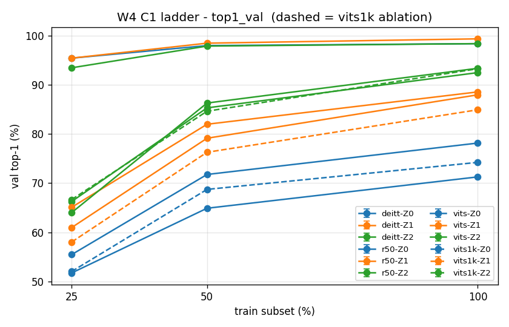
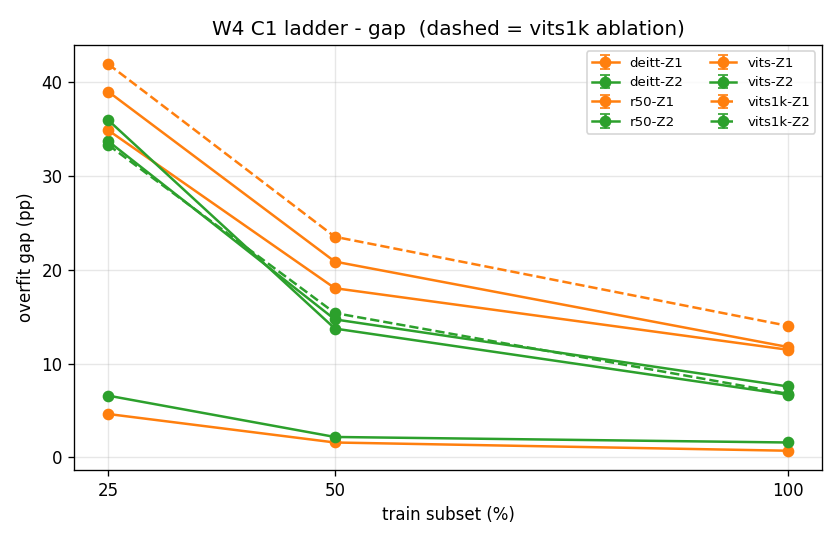
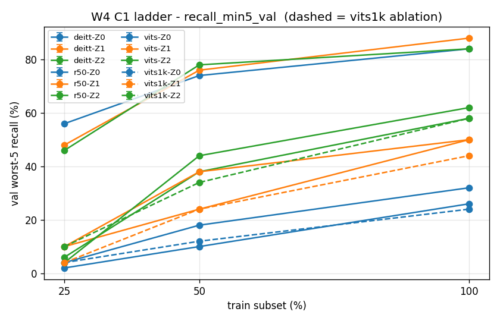
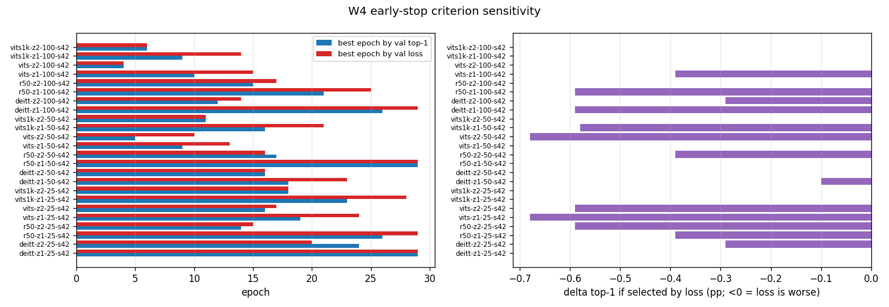

# T1 · W4 初步结论报告（初版）

> **状态**：初版；seed 42 单种子；全部数字为 **val 口径**（1020 张，每类 10 张）；**test 未碰**
> **数据来源**：`experiments.csv` 31 组（计划 18 + 补跑 50% 档 9 + 起点消融 4），与 `notes/W4_report.md`、`results/*.json` 逐组核对一致
> **分级口径**：**结论级** = 差值过 3 点门槛（或数学恒等）；**信号级** = 方向明确但不足 3 点门槛，待 W7 补种子定案
> 本文件是中间收口与素材底稿，W8 论文式最终报告由本人撰写。

---

## 0. 结论速览

| # | 结论 | 强度 |
|---|---|---|
| 1 | ViT-S(21k) 全档领先，无交叉点：其零样本 NCM（98.33%，100% 档）高于 ResNet-50 全参微调（93.33%），差 5.0 点 | 结论级 |
| 2 | ViT-S 三种训练方式在每档收敛到同一水平（档内极差 ≤ 1.96 点），预训练特征完全主导 | 结论级 |
| 3 | full-FT 收益随起点变弱而变大：deitt / vits1k 为 +4.5~8.6 点；vits(21k) 为 −0.6~−2.0 点；r50 25% 档转负 −1.08 | deitt/vits1k 结论级；vits/r50-25% 信号级 |
| 4 | 21k 预训练的价值随数据缩减放大：同策略差值 +14.41 点（100% 档）→ +37.35 点（25% 档） | 结论级 |
| 5 | 25% 档换策略后名次翻转（ResNet-50 从第 2 掉到末位），幅度 2.25~2.65 点，存在交互效应 | 信号级 |

---

## 1. 协议摘要

**表 1　协议摘要**

| 项 | 内容 |
|---|---|
| 数据集 | Flowers-102：train 1020（10/类）/ val 1020（10/类）/ test 6149（仅 W8 碰一次） |
| 档位 | 25%（204 张，每类 2 张）/ 50%（510 张，每类 5 张）/ 100%（1020 张，每类 10 张）；嵌套索引 + hash 已落盘 |
| 架构 | ResNet-50（1k 起点，CNN 参照）/ ViT-S（21k+1k 起点）/ DeiT-Ti（1k 起点，蒸馏结构、不接 teacher） |
| 策略 | Z0 = NCM 零训练，Z1 = head-only，Z2 = full-FT |
| 固定项 | seed 42；`epochs=30 + patience=5`；增强 basic；评估 token（ViT/DeiT 取 `cls`、R50 取 `gap`）；归一化按架构各走各的（ViT-S 为 0.5/0.5） |
| 评估 | top-1 / macro-F1 / recall_mean / recall_min5；**val 上 top-1 ≡ macro-recall（数学恒等，每类恰好 10 张）** |

下文简写：`r50` = ResNet-50；`vits` = ViT-S(21k+1k)；`vits1k` = ViT-S(仅 1k，起点消融用)；`deitt` = DeiT-Ti。

---

## 2. 主结果

**表 2　val top-1（%）**

| 架构（起点） | 策略 | 25% (2-shot) | 50% (5-shot) | 100% (10-shot) |
|---|---|---|---|---|
| ResNet-50 (1k) | Z0 | 51.76 | 64.90 | 71.27 |
| | Z1 | 65.10 | 81.96 | 88.53 |
| | Z2 | 64.02 | 86.27 | 93.33 |
| ViT-S (21k+1k) | Z0 | 95.39 | 97.94 | 98.33 |
| | Z1 | 95.39 | 98.43 | 99.31 |
| | Z2 | 93.43 | 97.84 | 98.33 |
| DeiT-Ti (1k) | Z0 | 55.49 | 71.76 | 78.14 |
| | Z1 | 60.98 | 79.12 | 87.94 |
| | Z2 | 66.27 | 85.29 | 92.45 |
| ViT-S (仅1k) | Z1 | 58.04 | 未跑（W5 补） | 84.90 |
| | Z2 | 66.67 | 未跑（W5 补） | 93.24 |

> **图 1　val top-1 阶梯图**（`W4_ladder_1_top1_val.png`）
> 横轴 = train 子集档位（25 / 50 / 100%），纵轴 = val top-1；一条线 = 一个「架构-策略」组合，颜色区分策略（蓝 Z0 / 橙 Z1 / 绿 Z2），虚线 = vits1k 起点消融；当前单种子，误差棒待 W7。
> 读法：同一颜色的三条实线比出架构差异，同一架构跨颜色比出策略影响，折线斜率说明各模型对数据量有多敏感。等价的 macro-F1 图见 `W4_ladder_2_macro_f1_val.png`（与 top-1 全程差 < 0.6 点，故正文不再单列）。

---

## 3. H1–H5 逐条判定

| # | 命题 | W4 判定 | 依据 |
|---|---|---|---|
| H1 | ViT-S 小数据输给 CNN | **不成立**（结论级） | 图 1：vits 蓝线 25% 档 95.39，高于 r50 同档任何策略（最高 65.10） |
| H2 | 数据量升 ViT 反超（有交叉点） | **对 ViT-S 不适用**（结论级）：全程领先。对 DeiT-Ti vs R50：Z2 下 25% 档反超 2.25 点，50/100 档又被反超，**非单调**（信号级） | 表 2、第 5 节 |
| H3 | 蒸馏补回小数据短板 | 本周无证据（维度 D 属 W5） | — |
| H4 | 蒸馏/增强功劳可 2×2 拆分 | 本周无证据（W5） | — |
| H5 | 小数据 head-only ≈ full-FT | **部分成立**：vits(21k) 成立（信号级）；deitt / vits1k 不成立（结论级）；r50 仅 25% 档成立（信号级） | 表 4 |

---

## 4. 核心发现

### 4.1 ViT-S(21k)：策略几乎不影响结果

**表 3　vits 各档三策略对照（%）**

| 档位 | Z0 | Z1 | Z2 | 档内极差 |
|---|---|---|---|---|
| 25% | 95.39 | 95.39 | 93.43 | 1.96 |
| 50% | 97.94 | 98.43 | 97.84 | 0.59 |
| 100% | 98.33 | 99.31 | 98.33 | 0.98 |

三档极差全部低于 3 点门槛，「不训 / 只训头 / 全参」没有实质差别。对照：r50 与 deitt 的档内极差在 100% 档分别为 22.06、14.31 点。

### 4.2 full-FT 的收益由起点强度决定

**表 4　Z2 − Z1（同档同架构，正 = full-FT 更好）**

| 架构（起点强度） | 25% | 50% | 100% | 判定 |
|---|---|---|---|---|
| deitt (1k) | +5.29 | +6.17 | +4.51 | 有收益（结论级） |
| vits1k (仅1k) | +8.63 | 未跑 | +8.34 | 有收益（结论级） |
| r50 (1k) | −1.08 | +4.31 | +4.80 | 50/100 有收益（结论级）；25% 转负（信号级） |
| vits (21k+1k) | −1.96 | −0.59 | −0.98 | 无收益，方向一致为负（信号级） |

起点越弱越该解冻；起点够强时解冻反而略有害。与之呼应的是过拟合 gap（图 2）：25% 档 full-FT 的 gap 最大（vits-Z2 6.57、r50-Z2 35.98）。

> **图 2　过拟合 gap 阶梯图**（`W4_ladder_4_gap.png`）
> 纵轴 = `top1_train − top1_val`（百分点），其余编码同图 1；Z0 无训练故无此读数（图中不出现）。
> 读法：gap 越大说明「记住训练集但没泛化」的成分越重。要点是 25% 档绿线（Z2）普遍抬升，而 vits 三条线始终贴近 0——即 21k 起点即使全参微调也没有明显过拟合。

### 4.3 起点消融（A′）：21k 预训练的价值随数据缩减放大

**表 5　vits(21k) − vits1k(仅1k)，同架构同协议**

| 策略 | 100% 档 | 25% 档 |
|---|---|---|
| Z1（冻结，纯特征质量） | +14.41 | +37.35 |
| Z2（全参微调） | +5.09 | +26.76 |

两个走向。一是数据越少 21k 越值钱，Z1 从 +14.4 放大到 +37.4。二是全参解冻把这份优势压缩了约 2/3（100% 档 14.41 → 5.09），说明下游小数据会部分覆盖预训练特征。全表最差的训练组正是弱起点加极小数据：vits1k-Z1-25 = 58.04。

### 4.4 长尾（recall_min5）

> **图 3　最差 5 类平均 recall 阶梯图**（`W4_ladder_3_recall_min5_val.png`）
> 纵轴 = 102 类中 recall 最低的 5 类的平均值（%），其余编码同图 1。
> 读法：只作「长尾有没有塌」的定性灯——val 每类仅 10 张，单类 recall 只有 11 档分辨率（0/10/…/100），低值常常直接贴 0。要点：100% 档 vits 系 84~88，对 r50 62、deitt 58；25% 档 vits1k 与 deitt 掉到 4 和 6（接近全错）。逐类分析留到 W8 的 test（每类 20~238 张）。

---

## 5. 交互效应：25% 档名次随策略翻转

**表 6　25% 档名次对照**

| 名次 | Z1（冻结） | Z2（全参） |
|---|---|---|
| 1 | vits 95.39 | vits 93.43 |
| 2 | r50 65.10 | vits1k 66.67 |
| 3 | deitt 60.98 | deitt 66.27 |
| 4 | vits1k 58.04 | r50 64.02 |

ResNet-50 从第 2 掉到末位，两个 1k 起点的小模型反超它；互换幅度 2.25~2.65 点，均不足 3 点门槛，故为信号级。另一个聚集现象：100% 档 Z2 下三个 1k 起点模型挤在 1 点内（93.33 / 93.24 / 92.45），只剩 21k 的 vits 独一档。

---

## 6. 早停口径敏感性

22 个训练组中，按 val-top1 与按 val-loss 选点同轮的仅 6 组，但改用 loss 选点的最大代价只有 −0.68 点（vits-z1-25、vits-z2-50），远小于 3 点门槛。选点口径不构成混杂源。

> **图 4　选点口径对比**（`W4_earlystop_1_criterion.png`）
> 左图：每组的两个最佳轮号横向条形（蓝 = 按 val top-1 选，红 = 按 val loss 选），纵轴为各组 eid；
> 右图：改用 loss 选点相对 top-1 选点的 top-1 差值（百分点，负值 = 更差）。
> 读法：左图两色条错位说明两种标准选到不同轮；右图全部条长 < 0.7 点，是「错位但不影响结果」的直接证据。

---

## 7. 卫生与资源

**表 7　实验卫生与资源**

| 项 | 结果 |
|---|---|
| 断言 | 31/31 组 `assert_ok=True`（Z0 权重零变化 / Z1 只有 head 变 / Z2 至少一层 backbone 变） |
| 异常 | 无 NaN、无 degraded |
| 机时 | 约 145 分钟（训练组约 144 分钟，Z0 秒级） |
| 显存 | 峰值 2.078 GB / 8 GB，OOM 降级路径未触发 |
| 修复验证 | Z0 误用增强（修复后 Z0 提升 7~11 点）；DeiT 评估路径由 `(CLS+dist)/2` 改为显式 `norm(CLS)`（max\|diff\| = 0.0） |
| 可复现 | `subsets/` 四档索引 + hash 落盘；test 全程未碰 |

---

## 8. 异常与待查（不阻断 W5）

1. r50 / deitt 的 Z0 `ncm_check` 为 `ok=False`：kNN(k=1) 落后 NCM 4.2~8.1 点（vits 仅 0.6~3.1），r50 回代准确率 0.88~1.00 低于自检预期 0.99。判断不是实现 bug——vits 通过同一套检查，且回代率随数据量增大反而下降（1.00 → 0.88），符合特征空间真实类重叠。待查：抽 r50-Z0 的混淆对，看是哪些类黏在一起。
2. deitt-Z2-25 按 loss 选点差 0.29 点：噪声级，仅记录。

---

## 9. 局限

1. **单种子**：结论级判定用的是 3 点经验门槛而非统计检验；W7 补种子后 ±1σ 复核，信号级项可能翻。
2. 全部为 val 数字（±1σ ≈ 0.9 点）；test 只在 W8 跑一次。
3. val 上 top-1 ≡ macro-recall（恒等），且 macro-F1 与 top-1 全程差 < 0.6 点，开发期实质只有 top-1 + recall_min5 两个有效读数。
4. recall_min5 只有 11 档分辨率，长尾结论到 test 才能定量化。
5. 沿用 W4_notes 登记的 5 条「决定不修」（teacher ckpt 无 git_commit、mode 大小写、梯度累积未实现等）。
6. ViT-S 主表用 21k 起点，架构比较中混有「预训练量差 11 倍」，已由 A′ 消融量化（表 5），对外表述时两列需同时出现。

---

## 10. 指向 W5

**表 8　W5 待办与口径**

| 项 | 内容 |
|---|---|
| 维度 D 记账 | 8 arm = 复用 2（`deitt-z2-{100,25}-s42` 即「无 teacher × 普通增强」）+ 新跑 6；`-strong` / `-distill` 后缀当口径指纹 |
| 蒸馏 loss | `0.5·CE(head,y) + 0.5·CE(head_dist, argmax(teacher(x)))`，无温度 T（DeiT 论文：soft 蒸馏零增益） |
| 强增强配方 | 照 DeiT 官方值：`rand-m9-mstd0.5-inc1` + Mixup(0.8) + CutMix(1.0) + label_smoothing 0.1 |
| 硬约束 | teacher 必须在线前向（口径 27）：其 `top1_train = 1.0`，缓存 hard label 会让蒸馏项退化成第二次 CE、Δ 恒 0 |
| 补跑 | vits1k 的 Z0×3（Z0 并非与起点无关，NCM 直接建在预训练特征上）+ 50% 档起点消融 |
| 文献锚点 | DeiT 论文中「卷积 teacher 到 Transformer 学生」是最有效配对（RegNetY-4GF teacher，+0.9）；本项目 R50 到 DeiT 正属此类。引用时需标注论文设定（IN-1k / 300ep / 86M）与本设定（1020 张 / 5.56M）的差异 |

---

*报告生成 2026-10-06；数据快照 `experiments.csv` @ commit `493081e`；图表目录 `notes/`*
