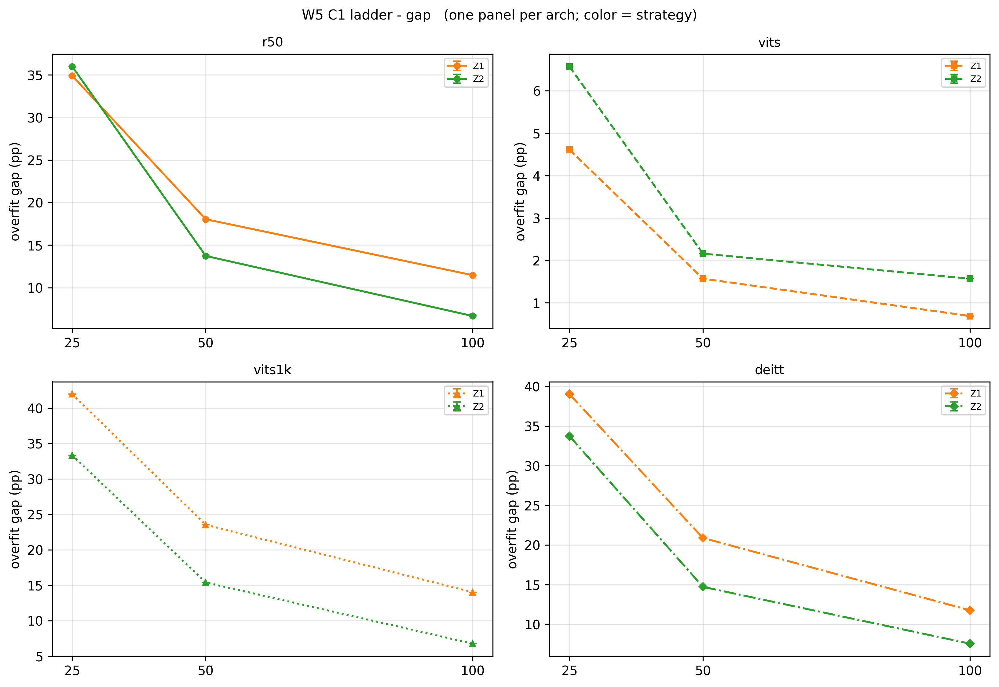
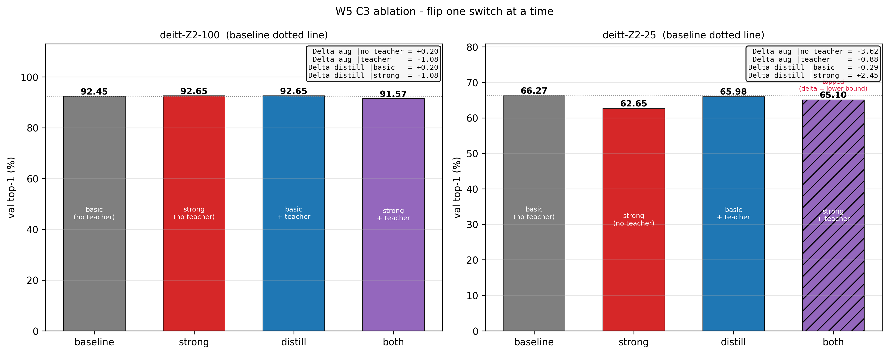
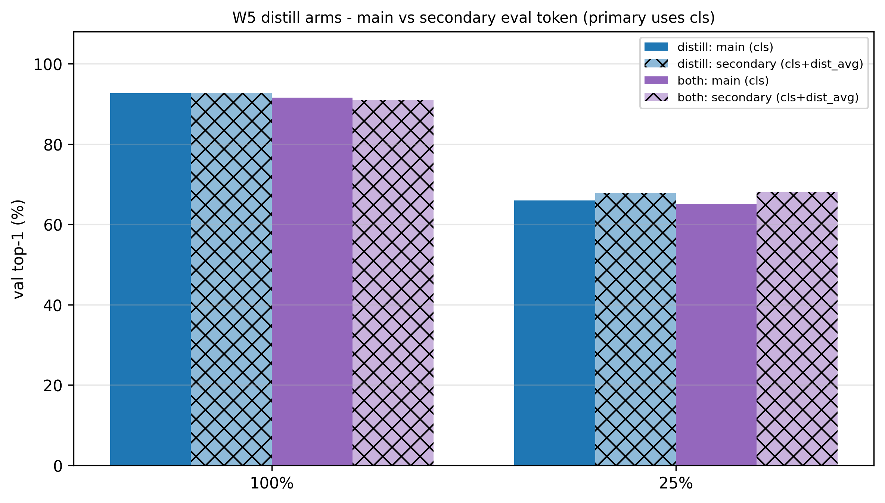
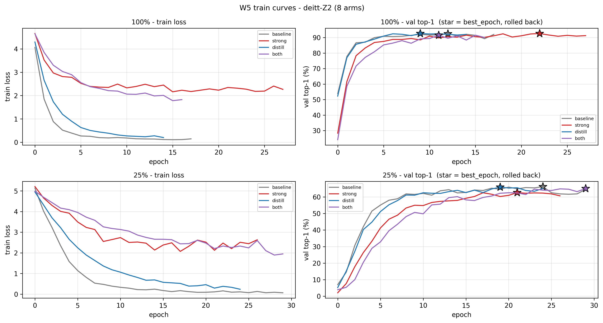

# T1 · W5 阶段性结论报告

> **状态**：seed 42 单种子；全部数字为 **val 口径**（1020 张，每类 10 张）；**test 未碰**；误差棒待阶段二补种子
> **数据来源**：`experiments.csv` **42 组**（W4 的 31 组 + 维度 D 6 组 + `vits1k` 剩余 5 组），与 `results/*.json` 逐组核对一致；图表由 `make_figures.py` 读表生成
> **分级口径**：**结论级** = 差值过 3 点门槛（或数学恒等）；**信号级** = 方向明确但不足 3 点门槛，待阶段二补种子定案
> **相对 W4 版的变化**：起点消融从 2 组补到 5 组、维度 D 从 0 组到 6 组；**主结论被改写**（第 3.3 节）
> 本文件是中间收口与素材底稿，阶段三的论文式最终报告由本人撰写。

---

## 0. 结论速览

| # | 结论 | 强度 |
|---|---|---|
| 1 | **「ViT-S 完胜」的归因被改写**：同等预训练量（1k）下 ResNet-50 的冻结特征全面优于 ViT-S，领先 3.6~7.1 点（三档全过门槛）。主表里 ViT-S 的优势来自 21k 预训练，**不是架构** | 结论级 |
| 2 | 21k 预训练的价值随数据缩减单调放大：同策略差值 Z0 +24.11→+43.33、Z1 +14.41→+37.35、Z2 +5.09→+26.76（100%→25% 档） | 结论级 |
| 3 | **零训练档（Z0）才是起点影响最大的一档**，不是最小：25% 档 43.33 点，高于 Z1 的 37.35 与 Z2 的 26.76 | 结论级 |
| 4 | 「策略几乎不影响结果」是 **21k 起点**的性质，**不是 ViT 架构**的性质：`vits` 档内极差 ≤1.96 点，`vits1k` 为 14.61~19.02 点 | 结论级 |
| 5 | **维度 D 的两个开关都没有可靠收益**：四个 Δ 全部落在 ±3.62 点内，唯一的边界值 −3.62 是 25% 档「强增强、无 teacher」的负向结果 | 结论级（负结果） |
| 6 | full-FT 的收益由起点强度决定：`vits1k` 三档稳定 +8.34~+8.63、`deitt` +4.51~+6.17、`r50` 的 100/50 档 +4.31~+4.80；`vits`(21k) 三档一致为负但不过门槛 | 前三者结论级；`vits` 信号级 |
| 7 | 评估 token 副读数在小数据档一致偏高（25% 档 +1.86 / +2.94，100% 档 +0.10 / −0.59），方向一致但不过门槛 | 信号级 |
| 8 | 策略决定胜负关系：ResNet-50 与 DeiT-Ti 在 Z0 与 Z1 档**名次完全反转**（Z0 档 DeiT 领先 3.7~6.9 点，Z1 档 R50 领先 0.6~4.1 点） | 结论级 |

---

## 1. 协议摘要

**表 1　协议摘要**

| 项 | 内容 |
|---|---|
| 数据集 | Flowers-102：train 1020（10/类）/ val 1020（10/类）/ test 6149（仅阶段三碰一次） |
| 档位 | 25%（204 张，每类 2 张）/ 50%（510 张，5/类）/ 100%（1020 张，10/类）；嵌套索引 + hash 已落盘。10% 档属阶段一 |
| 架构（起点） | `r50` = ResNet-50（1k）/ `vits` = ViT-S（21k+1k）/ `vits1k` = ViT-S（仅 1k，起点消融）/ `deitt` = DeiT-Ti（1k，带 dist token 结构、不接 teacher） |
| 策略 | Z0 = NCM 零训练 / Z1 = head-only / Z2 = full-FT |
| 固定项 | seed 42；`epochs=30 + patience=5`；增强 basic；归一化按架构各走各的（ViT-S 为 0.5/0.5，其余 ImageNet-1k） |
| 评估 token | 全部 `cls`（口径 24：副读数与主口径分开存 `top1_val_distavg` 列） |
| 四口径 | top-1 / macro-F1 / recall_mean / recall_min5；**val 上 top-1 ≡ recall_mean（数学恒等，每类恰好 10 张）** |
| 显著性门槛 | 差值 ≥3 点（≈3× 单点噪声 0.9）；**这是启发式，不是统计检验** |
| 蒸馏口径 | hard 蒸馏，`0.5·CE(head,y) + 0.5·CE(head_dist, argmax(teacher(x)))`，α=0.5，**无温度 T**；teacher 在线前向（看同一份增强且 mix 后的 batch） |
| 强增强配方 | RandAugment `rand-m9-mstd0.5-inc1` + Mixup(0.8) + CutMix(1.0, prob 1.0, switch 0.5) + label_smoothing 0.1；**照 DeiT 官方值、未自调；不含 RandomErasing 与 stochastic depth** |

---

## 2. 主结果

**表 2　val top-1（%），列序 25 / 50 / 100 档**

| 架构（起点） | 策略 | 25% (2-shot) | 50% (5-shot) | 100% (10-shot) |
|---|---|---|---|---|
| `r50` (1k) | Z0 | 51.76 | 64.90 | 71.27 |
| | Z1 | 65.10 | 81.96 | 88.53 |
| | Z2 | 64.02 | 86.27 | 93.33 |
| `vits` (21k+1k) | Z0 | 95.39 | 97.94 | 98.33 |
| | Z1 | 95.39 | 98.43 | 99.31 |
| | Z2 | 93.43 | 97.84 | 98.33 |
| `vits1k` (仅 1k) | Z0 | 52.06 | 68.73 | 74.22 |
| | Z1 | 58.04 | 76.27 | 84.90 |
| | Z2 | 66.67 | 84.61 | 93.24 |
| `deitt` (1k) | Z0 | 55.49 | 71.76 | 78.14 |
| | Z1 | 60.98 | 79.12 | 87.94 |
| | Z2 | 66.27 | 85.29 | 92.45 |

> **图 1　val top-1 数据量阶梯图**（`F1_ladder_1_top1_val.png`）
> 画的是什么：横轴 = train 子集档位 25 / 50 / 100%（对数刻度，即每类 2 / 5 / 10 张），纵轴 = val top-1（%）。一条线 = 一个「架构 × 策略」组合，颜色区分策略（蓝 Z0 / 橙 Z1 / 绿 Z2），**虚线 = `vits1k` 起点消融**。评估划分 val、单种子、评估 token 全为 `cls`。
> 怎么读：同色实线比架构，同架构跨颜色比策略，线越陡说明该模型对数据量越敏感。要点三处：绿色三条线在 25% 档已挤到 93% 以上而蓝橙两档散得很开（第 3.2 节）；橙色虚线（vits1k-Z1）整段压在橙色实线（r50-Z1）之下（第 3.3 节）；四条虚线与对应实线的垂直距离随档位变小而变大（第 3.1 节）。等价 macro-F1 图见 `figures/F1_ladder_2_macro_f1_val.png`（与 top-1 全程差 <0.6 点，不单列）；长尾见第 6 节表 12。

> **图 2　过拟合 gap 阶梯图**（`F1_ladder_4_gap.png`）
> 画的是什么：纵轴 = `top1_train − top1_val`（百分点），横轴与颜色编码同图 1。Z0 无训练过程、无 gap 读数，故不出现在图中。
> 怎么读：gap 大 = 「记住训练集但没泛化」的成分重。要点两条：25% 档所有训练组普遍抬升（`vits1k`-Z1 41.96、r50-Z2 35.98、deitt-Z2 33.73），说明小数据全参微调确实在过拟合；而 `vits` 三条线全程贴近 0（0.69~6.57），与图 1 中它「怎么训都一样」互为印证。

---

## 3. 核心发现

### 3.1 起点消融（A′）：21k 的价值随数据缩减放大，且 Z0 档最大

**表 3　`vits`(21k) − `vits1k`(仅 1k)，同架构同协议同策略**

| 策略 | 25% 档 | 50% 档 | 100% 档 | 趋势 |
|---|---|---|---|---|
| Z0（NCM，纯特征） | +43.33 | +29.21 | +24.11 | 单调放大，幅度最大 |
| Z1（冻结特征 + 线性头） | +37.35 | +22.16 | +14.41 | 单调放大 |
| Z2（全参微调） | +26.76 | +13.23 | +5.09 | 单调放大，幅度最小 |

三个策略全部单调，这条趋势是稳的。两个读数值得单列：

- **Z0 档的起点差值最大（25% 档 43.33 点），不是最小。** W4 计划里写「Z0 与起点无关」是前提级错误——Z0 的 NCM 建在预训练特征上，起点是它唯一的输入。等价说法：不训练不等于不吃权重。
- **全参解冻会吃掉一部分起点优势，但数据越少吃得越少**：Z2 保留的份额为 100% 档 35.3%、50% 档 59.7%、25% 档 71.6%。下游数据越少，预训练质量越难被微调覆盖。

### 3.2 「策略无关性」属于 21k 起点，不属于 ViT 架构

**表 4　各架构的档内三策略极差（%）**

| 架构 | 25% 档极差 | 50% 档极差 | 100% 档极差 | 100% 档取值范围 |
|---|---|---|---|---|
| `vits` (21k+1k) | 1.96 | 0.59 | 0.98 | 98.33 ~ 99.31 |
| `vits1k` (仅 1k) | 14.61 | 15.88 | 19.02 | 74.22 ~ 93.24 |
| `r50` (1k) | 13.34 | 21.37 | 22.06 | 71.27 ~ 93.33 |
| `deitt` (1k) | 10.78 | 13.53 | 14.31 | 78.14 ~ 92.45 |

W4 报告里「ViT-S 怎么训都一样」这条观察成立，但归因错了。补上 `vits1k` 的 Z0 后可见：同一个 ViT-S 架构只把起点从 21k 换成 1k，档内极差就从 ≤1.96 跳到 14.61~19.02，与 CNN、DeiT 同量级。所以「训练方式不重要」是 21k 特征强到让下游怎么训都无所谓，**不是 ViT 架构的性质**。

### 3.3 同等预训练量下，CNN 的冻结特征优于 ViT

**表 5　三个 1k 起点架构的横向对照（Δ = 该架构 − ResNet-50，正 = 高于 ResNet-50）**

| 策略 | 档位 | `r50` | `vits1k` | `deitt` | Δ(vits1k) | Δ(deitt) |
|---|---|---|---|---|---|---|
| Z0 | 25% | 51.76 | 52.06 | 55.49 | +0.30 | +3.73 |
| | 50% | 64.90 | 68.73 | 71.76 | +3.83 | +6.86 |
| | 100% | 71.27 | 74.22 | 78.14 | +2.95 | +6.87 |
| Z1 | 25% | 65.10 | 58.04 | 60.98 | **−7.06** | **−4.12** |
| | 50% | 81.96 | 76.27 | 79.12 | **−5.69** | −2.84 |
| | 100% | 88.53 | 84.90 | 87.94 | **−3.63** | −0.59 |
| Z2 | 25% | 64.02 | 66.67 | 66.27 | +2.65 | +2.25 |
| | 50% | 86.27 | 84.61 | 85.29 | −1.66 | −0.98 |
| | 100% | 93.33 | 93.24 | 92.45 | −0.09 | −0.88 |

按可靠性排序三条：

- **Z1 档（冻结特征 + 线性头）ResNet-50 全面领先**，对 `vits1k` 三档为 −3.63 / −5.69 / −7.06，**全部过 3 点门槛**。冻结特征时上游卷积先验的局部性、平移等变性是实打实的优势，这是本报告最干净的一条因果证据。
- **Z2 档三者挤进 ±2.7 点**，25% 档两个 Transformer 反而略高——解冻即抹平架构差异。
- **Z0 档 Transformer 领先**（DeiT-Ti +3.73~+6.87）。这一档只用类中心分类，衡量的是特征在欧氏距离下的类内紧致度；Z1 衡量的是「特征配一个学到的线性头好不好用」，两者是两件事，见第 5 节。

由此 H1 可以给出准确表述：它在**同等预训练量下成立**（Z1 档 −3.6~−7.1 点），主表里看到的「不成立」是 11 倍预训练量的产物。这正是 A′ 维度存在的理由。

### 3.4 full-FT 的收益由起点强度决定

**表 6　Z2 − Z1（同档同架构，正 = full-FT 更好）**

| 架构（起点强度） | 25% | 50% | 100% | 判定 |
|---|---|---|---|---|
| `vits1k` (仅 1k) | +8.63 | +8.34 | +8.34 | 有收益，三档高度一致（结论级） |
| `deitt` (1k) | +5.29 | +6.17 | +4.51 | 有收益（结论级） |
| `r50` (1k) | −1.08 | +4.31 | +4.80 | 50/100 档有收益（结论级）；25% 档转负（信号级） |
| `vits` (21k+1k) | −1.96 | −0.59 | −0.98 | 方向一致的负，三档均不过门槛（信号级） |

起点越弱，解冻越划算；起点足够强时解冻略有小害。`vits1k` 三档稳定在 +8.4 附近是最整齐的一组——同架构、同策略、只换数据量，收益几乎不变，说明它衡量的是「特征够不够用」，而不是「数据够不够多」。

### 3.5 维度 D：蒸馏与增强各贡献多少

固定 `deitt` + Z2 + 25%/100% 两档，翻转两个开关各一次。

**表 7　维度 D 的四个 Δ（百分点）**

| 差值的定义 | 100% 档 | 25% 档 |
|---|---|---|
| Δ增强（无 teacher）：strong − basic | +0.20 | −3.62 |
| Δ增强（有 teacher）：strong − basic | −1.08 | −0.88 |
| Δ蒸馏（basic 增强）：有 − 无 teacher | +0.20 | −0.29 |
| Δ蒸馏（strong 增强）：有 − 无 teacher | −1.08 | +2.45 |

**表 8　维度 D 四个 arm 的数值（%）**

| 臂 | 配置 | 100% 档 | 25% 档 |
|---|---|---|---|
| baseline | basic 增强、无 teacher | 92.45 | 66.27 |
| strong | strong 增强、无 teacher | 92.65 | 62.65 |
| distill | basic 增强、有 teacher | 92.65 | 65.98 |
| both | strong 增强、有 teacher | 91.57 | 65.10 |

> **图 3　维度 D 消融柱图**（`F3_ablation.png`）
> 画的是什么：左右子图分别为 100% 与 25% 档，各 4 根柱对应 4 个 arm（灰 baseline / 红 strong / 蓝 distill / 紫 both），柱高 = val top-1（%）；灰色点线为 baseline 水平线，右上内嵌框列出四个 Δ 的数值。斜纹柱 = 该组 `best_epoch ≥ 28`（撞到 30 epoch 预算上限，见第 4 节）。
> 怎么读：看柱高有没有越过 baseline 点线。100% 档四根柱几乎等高（91.57~92.65，跨度 1.08）；25% 档唯一明显偏离的是红柱（强增强比 baseline 低 3.62 点）。内嵌框里的四个 Δ 是第 3.5 节结论的来源，**注意它们都是单种子、未过 3 点门槛的差值**。

三条结论都是负结果：

- **硬蒸馏量不到收益**：Δ蒸馏在 basic 水平 +0.20 / −0.29、strong 水平 −1.08 / +2.45，方向不一致且无一过门槛。basic 水平这组 ≈0 是**预登记的结构性结果**——teacher 由 basic 增强训出，在「train + basic 增强」视图上仍有 97.65 / 99.02% 正确（`y_t ≈ y`），蒸馏项退化成第二次普通 CE。所以只能写成「蒸馏收益依赖 teacher 在增强视图上的不确定性」，**不能写成「basic 下蒸馏没用」**。strong 档是唯一有信息量的读数：teacher 在 RandAugment 视图上只有 83.04 / 84.61% 正确。
- **强增强在 100% 档无用、在 25% 档有害**：+0.20 与 −3.62，后者是四个 Δ 中唯一的过门槛值，方向为负。
- **两者不互相替代，而是都不起作用**：原本想看「增强已很强时蒸馏还剩多少边际收益」，实测两个轴上的 Δ 都在噪声级。

> **本节的硬限定（口径 29）**：25% 档的 `both` 臂 `best_epoch = 29 / 30`，撞到预算上限，说明可能欠训练。因此 25% 档那两个差值（Δ增强|有 teacher = −0.88、Δ蒸馏|strong = +2.45）**是下界**，真实值只会更大。这意味着**若放宽 epoch 预算，Δ蒸馏|strong 有机会越过 3 点门槛**；阶段一若有余量优先做这件事。

### 3.6 评估 token 副读数

**表 9　主口径（`cls`）与副读数（`cls+dist_avg`）对照（仅蒸馏臂）**

| 臂 | 档位 | 主口径 cls | 副读数 cls+dist_avg | 差 |
|---|---|---|---|---|
| distill | 100% | 92.65 | 92.75 | +0.10 |
| distill | 25% | 65.98 | 67.84 | +1.86 |
| both | 100% | 91.57 | 90.98 | −0.59 |
| both | 25% | 65.10 | 68.04 | +2.94 |

> **图 4　主口径与副读数对照图**（`F4_distill_token.png`）
> 画的是什么：横轴为两个数据档（100% / 25%），每组 4 根柱——`distill` 臂的主口径（实心深蓝）与副读数（浅蓝斜纹）、`both` 臂的主口径（实心紫）与副读数（浅紫斜纹）。纵轴 = val top-1（%）。
> 怎么读：实心柱与对应斜纹柱的高度差就是表 9 的「差」列。要点是**小数据档两对斜纹柱都更高（+1.86 / +2.94），100% 档两对几乎等高（+0.10 / −0.59）**；方向一致，但四个差都没到 3 点门槛，只记为信号级。

这一条是顺带发现，不属于预设命题。一种解释是：`head` 接真标签，在 25% 档过拟合更早；`head_dist` 接 teacher 硬标签，相当于多了一个正则化来源。**只作为信号记录，不进入任何结论。**

---

## 4. 训练动态与贴顶判据

> **图 5　训练曲线（8 个 arm）**（`F2_curves.png`）
> 画的是什么：按档位分两行（上行 100%、下行 25%），每行左图 = train loss 对 epoch、右图 = val top-1 对 epoch。四条曲线 = 四个 arm（灰 baseline / 红 strong / 蓝 distill / 紫 both），右图星号 = 回滚后的 `best_epoch`。
> 怎么读：左图看收敛速度，红紫两条（带强增强）的 loss 下降更慢、更高——这是强增强的正常形态，不是训练失败；右图看点在于 25% 档所有曲线的最高点都落在 20 轮以后，佐证表 10 的「欠训练」判断；baseline（灰）在 25% 档收敛最快、峰值最高，与表 8 中它是该档最佳臂一致。

**表 10　撞到 30 epoch 预算上限的组（`best_epoch ≥ 28`）**

| 组 | best_epoch / epochs_run | 影响 |
|---|---|---|
| `deitt-z2-25-s42-strong-distill` | 29 / 30 | 25% 档的 Δ增强\|有 teacher 与 Δ蒸馏\|strong 记作**下界** |
| `deitt-z1-25-s42` | 29 / 30 | deitt 的 25% 档 Z1 数字可能是低估 |
| `r50-z1-50-s42` | 29 / 30 | r50 在 Z1@50% 的领先是**下界**（对第 3.3 节结论有利） |

另有 `r50-z1-25-s42`（26/30）、`deitt-z1-100-s42`（26/30）接近但未撞顶。口径 29 决定**不逐组放宽 epoch 预算**——放宽会让维度 D 与主矩阵不再同口径，代价大于收益。放宽到收敛技术上可行（`protocol.py` 无 lr scheduler，早停是唯一收敛判据），但需重跑基线，留给阶段一有余量时决定。

---

## 5. 交互效应：策略决定胜负关系

**表 11　ResNet-50 与 DeiT-Ti 在三档策略下的对照（Δ = deitt − r50）**

| 档位 | Z0 档 | Z1 档 | Z2 档 |
|---|---|---|---|
| 25% | +3.73 | −4.12 | +2.25 |
| 50% | +6.86 | −2.84 | −0.98 |
| 100% | +6.87 | −0.59 | −0.88 |

**只换迁移策略，两个模型的名次完全反转**：Z0 档（NCM）DeiT-Ti 三档全胜，Z1 档（线性头）ResNet-50 三档全胜；Z2 档出现真正的交叉点，落在 25% 与 50% 档之间，即 **2~5 shot**。

这是设计文档预测的「第 3 项最值钱」的读数，W5 首次拿到完整证据。推论是：只跑一个策略，拿到的不是「谁更强」，而是「在那个策略下谁更强」。C1 常被引用的「ViT-S 没有交叉点」仍然成立（`vits` 全程领先 `r50` 25~43 点），但按第 3.3 节，其成因是预训练量而非架构，**对外表述时不能只说这一句**。

---

## 6. 长尾口径（recall_min5）

**表 12　最差 5 类平均 recall（%）**

| 架构 | 策略 | 25% 档 | 50% 档 | 100% 档 |
|---|---|---|---|---|
| `r50` | Z0 / Z1 / Z2 | 2.0 / 10.0 / 4.0 | 10.0 / 38.0 / 44.0 | 26.0 / 50.0 / 62.0 |
| `vits` | Z0 / Z1 / Z2 | 56.0 / 48.0 / 46.0 | 74.0 / 76.0 / 78.0 | 84.0 / 88.0 / 84.0 |
| `vits1k` | Z0 / Z1 / Z2 | 4.0 / 4.0 / 10.0 | 12.0 / 24.0 / 34.0 | 24.0 / 44.0 / 58.0 |
| `deitt` | Z0 / Z1 / Z2 | 4.0 / 10.0 / 6.0 | 18.0 / 24.0 / 38.0 | 32.0 / 50.0 / 58.0 |

读法只有一句：**长尾在所有 1k 起点模型上都是塌的，只有 21k 的 `vits` 是例外**（最差 5 类仍有 46~88%）。这与第 3.1 节是同一件事的另一个侧面——起点越弱、数据越少，最先牺牲的就是尾部类。

注意这一栏**分辨率只有 11 档**（val 每类恰好 10 张，单类 recall 只能是 0/10/…/100），低值常直接贴 0，只能当定性灯用。逐类分析与排序图必须等阶段三的 test（每类 20~238 张，步长 5 点）。等价阶梯图见 `figures/F1_ladder_3_recall_min5_val.png`。

---

## 7. H1–H6 逐条判定

**表 13　命题判定**

| # | 命题 | 判定 | 依据 |
|---|---|---|---|
| H1 | ViT-S 在小数据档输给 CNN | **限定条件下成立**：同等预训练量（1k）下成立，Z1 档 −3.6~−7.1 点过门槛；主表口径（21k vs 1k）不成立 | 表 5 |
| H2 | 数据量上升 ViT 反超（存在交叉点） | **对 `vits` vs `r50` 不存在**（全程领先，合法结论，100% 档已是全量无加档余地）；**对 `vits1k` vs `r50`、`deitt` vs `r50` 存在**，均落在 Z2 档 2~5 shot 之间 | 表 2、表 5、表 11 |
| H3 | 蒸馏能补回 ViT 的小数据短板 | **不成立**：四个 Δ蒸馏 均不过门槛，basic 水平的 ≈0 是结构性预登记结果 | 表 7 |
| H4 | 蒸馏与增强的功劳可被 2×2 拆开算 | **归因完成，但两者都量不到贡献**：四个 Δ 全在 ±3.62 内，唯一边界值为 25% 档强增强的 −3.62（负向） | 表 7、图 3 |
| H5 | 小数据下 head-only ≈ full-FT | **取决于起点**：`vits`(21k) 成立（信号级）；`r50` 的 100/50 档、`deitt`、`vits1k` 不成立（结论级） | 表 6 |
| H6 | hard 蒸馏 ≥ soft 蒸馏 | **本周无证据**：属阶段一的 2 组对照（温度 T 须先与 timm 源码及 DeiT 论文核对，不许凭记忆填） | — |

---

## 8. 卫生与资源

**表 14　实验卫生与资源**

| 项 | 结果 |
|---|---|
| 断言 | 42/42 组 `assert_ok=True`（Z0 权重零变化 / Z1 只有 head 变 / Z2 至少一层 backbone 变） |
| 异常 | 无 NaN、无 OOM，`degraded` 全为 `none` |
| 机时 | 累计 204.5 分钟（42 组，含 Z0 的秒级组），最长单组 13.29 分钟 |
| 显存 | 峰值 2.080 GB / 8 GB；蒸馏臂引入 teacher 前向后未触发降级 |
| 数值对齐 | `distill.py` 与 timm 现成实现对齐通过（hard 路的 CE 与 argmax 两路一致） |
| 重跑一致性 | 非蒸馏臂与 W4 快照逐位一致；强增强臂两次运行结果一致；蒸馏端到端 dry-run 字段完整（副读数 0.5127 对主口径 0.4941） |
| 可复现 | `subsets/` 三档索引 + hash 落盘；`eid` 带口径后缀（`-strong` / `-distill`）防静默跳过；test 全程未碰 |

---

## 9. 异常与待查（不阻断）

`ncm_check` 在 12 个 Z0 组中有 10 组报 `ok=False`。两个判据的实测值都随数据量单调变化，形态符合特征几何效应，不像实现错误——若是类中心误用 val 数据、用了增强特征或求均值前做了 L2 归一化，不会呈现这种随档位单调的形态；且 `vits` 通过同一套检查，说明检查逻辑本身能跑通。

**表 15　Z0 自检两判据的实测值**

| 判据 | 期望 | 实测 |
|---|---|---|
| 回代准确率 | ≥0.99 | `vits` 的 100% / 50% 档为 0.998（通过）；其余 10 组 0.877~1.000，**且随数据量增大而下降**（r50 三档 1.0000 → 0.9196 → 0.8775） |
| kNN(k=1) 与 NCM 的差 | ≤1~2 点 | `vits` 0.6~3.1 点；r50 4.2~6.8 点；deitt 6.1~8.1 点；vits1k 4.2~9.1 点 |

阶段一用 30 分钟按五条排查（打印回代具体数值、打印 kNN 对比、查是否误用 val 或增强特征、查是否有 L2 归一化、换种子看波动），查不出就原样写进最终报告的局限章节。必须查的理由：Z0 是「光靠预训练特征够不够用」的整条答案，且 `vits` 的 98.33% 被表 3、表 5 反复引用——类中心实现若真有偏差，这几个数的相对大小都可能翻转。

另一条仅记录：`deitt-Z2-25` 按 loss 选点比按 top-1 选点差 0.29 点，噪声级。

---

## 10. 局限与必写声明

**表 16　局限清单（末列为最终报告必须写出的条目）**

| # | 局限 | 为什么必须声明 |
|---|---|---|
| 1 | 全部 42 组为 seed 42 单种子 | 结论级判定用的是 3 点经验门槛，**门槛是启发式、非统计检验**；阶段二补 seed 43/44 后才给 ±1σ，信号级各项存在翻案可能 |
| 2 | σ 的口径 | 三种子样本标准差本身粗糙；且它度量的是**优化随机性**（增强随机序列 + head 初始化），**不含数据抽样方差**（子集索引固定），不能读成「换一批数据也差这么多」 |
| 3 | val / test 协议 | 开发期全部数字来自 val；test 仅在阶段三冻结 config 后评估一次、未用于任何选择（附 git tag / commit hash 为证）。test 若明显低于 val，按发现写出，不重跑 |
| 4 | basic 蒸馏臂 Δ≈0 是结构性结果 | 须与 strong 臂分开解读，**不得写成「basic 下蒸馏没用」**（teacher 在 train+basic 视图上仍有 97.65~99.02% 正确） |
| 5 | epoch 预算不逐组放宽 | 三个组撞顶（表 10），涉及它们的 Δ 是**下界** |
| 6 | 增强配方照 DeiT 官方值、未自调 | 且**故意排除** RandomErasing 与 stochastic depth，**不能写「复现了 DeiT 配方」**；强增强臂只是「增强」单轴上的一个操作点 |
| 7 | `ncm_check` 在 10 个 Z0 组未通过 | 排查记录与原样数值须进最终报告（第 9 节表 15） |
| 8 | val 的四口径实质只有两个有效读数 | top-1 ≡ recall_mean（数学恒等），macro-F1 与 top-1 全程差 <0.6 点，长尾只有 recall_min5 能看且分辨率仅 11 档 |
| 9 | 架构比较混着预训练量差异 | 已由 A′ 消融量化（表 3、表 5）。**对外引用表 2 时必须同时给出表 5**，否则「ViT-S 完胜」会被读成架构结论 |
| 10 | 沿用 W4 登记的 5 条「决定不修」 | teacher ckpt 未带 git_commit、mode 大小写、梯度累积未实现等 |

---

## 11. 下一步

**表 17　剩余任务（三阶段，对应原 W6 / W7 / W8）**

| 阶段 | 内容 | 解锁什么 |
|---|---|---|
| 阶段一 | ① **10% 档 12 组**（主矩阵 9 + vits1k 3）② **H6 soft 蒸馏 2 组** ③ **C4 注意力图** ④ **Z0 自检专项** ⑤ **Z1 无增强敏感性检查** ⑥ 有余量则放宽 25% 档 `both` 臂的 epoch 预算 | 数据量轴补到 1/2/5/10 shot 四档齐，交叉区间从外推变成观测；H6 判定；第 9 节收口 |
| 阶段二 | **补 seed 43/44 共 64 组**（Z0 不补，子集索引复用 seed-42、绝不重抽）→ 算 ±1σ → 画 C2 | 把信号级各项转成结论级；补上表 16 第 1 项的缺口 |
| 阶段三 | 冻结 config（记 tag）→ 放开 test 开关（单独提交）→ **test 9 组** + 追加 `top1_test` 列 → C1 定稿 + C5/C6/C7 → 论文式报告 + GitHub | val/test 双列主表；逐类与混淆矩阵分析（val 上做不出来） |

阶段一的开跑硬门槛中与本报告直接相关的有两条：H6 的 soft 蒸馏温度 T 必须先核对 timm 源码与 DeiT 论文并写出处；Z0 自检的时间盒为 30 分钟，不阻断其他任务。

---

*报告生成 2026-10-07；数据快照 `experiments.csv` 42 组（W4 段 commit `493081e`、vits1k 段 `54ee8d8`、维度 D 段 `09f9c45`）；图表目录 `figures/`；绘图脚本 `make_figures.py`*
