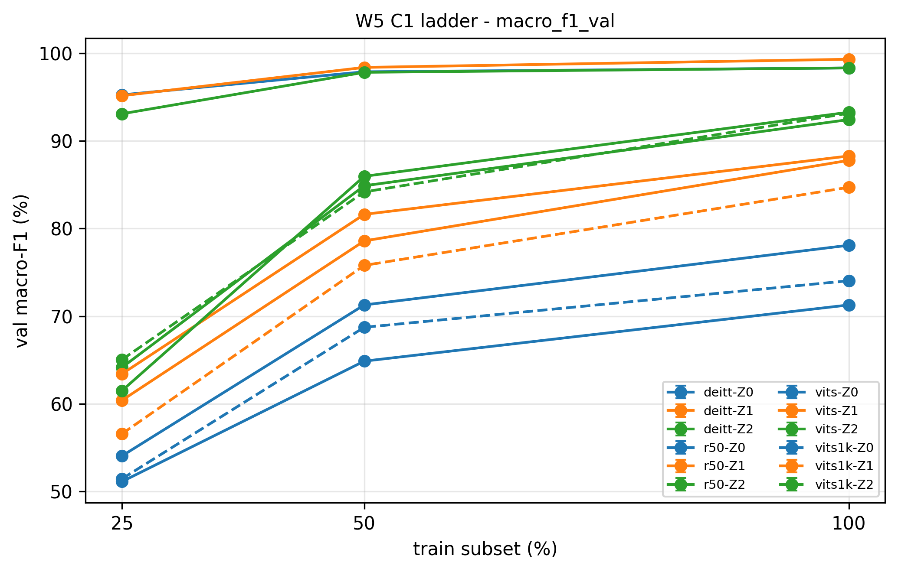
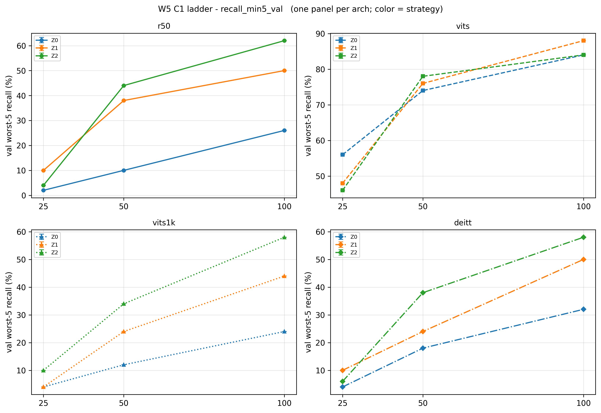

# 从手写 ViT 到迁移对照：视觉 Transformer 的小样本受控实验（Flowers-102）

**架构、预训练起点与迁移策略的受控对照** ｜ 完整实验报告 ｜ 项目总览：[README.md](../README.md)

> **数据边界**：全部数字来自 Flowers-102 的验证集（1020 张，每类 10 张），单一种子（seed 42），**测试集未参与任何开发决策**。共 42 个配置组合，逐组落盘，可复现。
>   
> **强度分级**：**已确认** = 差值超过 3 点经验门槛（约 3 倍单点噪声），或数学恒等；**待确认** = 方向明确但差值不足门槛，需要更多种子才能定案。

---

## 0. 摘要

**问题的来由**：本项目是作者 P0（手写 GoogLeNet 的猫狗分类：从零训练 vs 迁移学习，第一次受控对照）与 P1（Pascal VOC 目标检测的迁移学习受控检验）之后的第三次加深。P1 中一个反常读数促成了本实验：在小数据设定下，「加载预训练模型 → 全参微调 → 涨点」这个默认动作被证伪——全参微调相对零样本是净损害，而冻结主干的收益落在噪声内。由此真正值得问的就不是「ViT 和 CNN 谁更强」，而是：**在这个现象里，起作用的是架构、预训练数据的规模，还是迁移策略本身？** 后两者是可以受控切开的，因此把问题换到一个迭代更快的分类任务上，并补上「预训练数据量」这个在原实验中被固定的变量。

**实验回答的问题**：在小样本场景下（每类 2 至 10 张），模型的分类能力由什么决定——是网络架构、预训练数据的规模，还是下游的迁移策略？

**一句话结论**：在本实验的条件下，**预训练起点的强弱是主导变量，架构与迁移策略都是次要变量**。具体来说，常被引用的「ViT 在小数据上弱于 CNN」在本实验中不成立，但这个「不成立」本身也不该被读成架构结论——它来自两边的预训练数据量相差 11 倍。

| # | 问题                      | 回答                                                                          | 强度          |
| - | ----------------------- | --------------------------------------------------------------------------- | ----------- |
| 1 | 小数据下 ViT 是否输给 CNN       | **同等预训练量下成立**（冻结特征时 CNN 领先 3.6 至 7.1 点）；一旦预训练量差 11 倍，结论整体反转                 | 已确认         |
| 2 | 「换什么策略都差不多」是 ViT 架构的性质吗 | **不是**。同一个 ViT-S，只把预训练起点从 21k 换成 1k，同档内策略间的极差就从 2 点以内跳到 15 至 19 点，与 CNN 同量级 | 已确认         |
| 3 | 全参微调在小数据上划算吗            | **取决于起点强度**。起点弱（仅 1k）时净赚 5 至 9 点；起点足够强（21k）时三档一致微亏，但幅度不足门槛                  | 前者已确认，后者待确认 |
| 4 | 预训练量的价值随数据量怎么变          | **单调放大**。数据越少越值钱：冻结特征时领先幅度从 14.4 点（每类 10 张）涨到 37.4 点（每类 2 张）；且不训练的那一档受影响最大  | 已确认         |
| 5 | 蒸馏与强增强能补回小数据的短板吗        | **两个开关都量不到可靠收益**。四个差值全部落在 ±3.6 点内，唯一的过门槛值是负向的                               | 已确认（负结果）    |

**研究设计上的几处刻意安排**

| 安排 | 做法 | 目的 |
| ------------ | ------------------------------ | ---------------------------- |
| 命题预登记 | 6 条待检验命题在跑矩阵之前写下 | 防止事后解释数据；判定与命题一一对应 |
| 测试集只碰一次 | 开发期全部使用验证集；配置冻结前测试集不进视野 | 提前看会让测试集退化成第二个验证集，独立性消失 |
| 关闭 CUDA 非确定性 | 关掉自动调优，注意力计算强制走 math 后端 | 实测同配置两次运行差 2.4 点，会污染误差棒 |
| 跑完后回头审代码 | 逐字段反查配置的消费点，审出并修掉两处问题 | 「配置层写了」不等于「执行层接上了」 |
| 每个配置 27 列落盘 | 含代码提交号溯源、卫生断言、增强与蒸馏标记 | 使断点续跑与结果溯源可靠 |

**未回答的**：蒸馏的温度参数（soft 蒸馏）与逐类错误分布，属后续工作；在本文的数据边界下，上述所有结论都不能外推到其他数据集。

---

## 1. 术语与实验设置

> **关于项目名里的「手写 ViT」**：W1–W2 的注意力与 ViT 编码块由本人手写实现（`attention.py`、`vit.py`），并逐项与官方实现数值对齐（多头注意力误差 5.96e-08、ViT 编码块误差 4.71e-06），详见第 7.1 节与表 14。它是组件级产物，作用是把 Transformer 的内部机制拆到逐行、并为评估装置提供可验证的参照；下表列出的四个骨干均为 timm 预训练权重——小样本设定要求从预训练起点出发，不带预训练权重的手写版本不进入下面的对照矩阵。

**表 1　术语对照**

| 代号（亦为图中的标签） | 名称        | 定义                                                        |
| ----------- | --------- | --------------------------------------------------------- |
| 架构 `r50`    | ResNet-50 | 卷积网络，ImageNet-1k 预训练                                      |
| 架构 `vits`   | ViT-S     | 视觉 Transformer（小号），ImageNet-21k + 1k 预训练                  |
| 架构 `vits1k` | ViT-S（对照） | 同为 ViT-S，但**仅** ImageNet-1k 预训练，用于把「架构」与「预训练量」分开          |
| 架构 `deitt`  | DeiT-Ti   | 视觉 Transformer（极小号），ImageNet-1k 预训练；保留蒸馏 token 结构，但不接教师模型 |
| 策略 `Z0`     | 零训练分类     | 不训练任何参数，直接用预训练特征计算每个类的均值中心，按最近中心分类                        |
| 策略 `Z1`     | 线性探针      | 冻结骨干网络，只训练一个线性分类头                                         |
| 策略 `Z2`     | 全参微调      | 全部参数参与微调                                                  |

**表 2　实验设置**

| 项     | 内容                                                                                                                |
| ----- | ----------------------------------------------------------------------------------------------------------------- |
| 数据集   | Flowers-102：训练 1020 张（每类 10 张）/ 验证 1020 张（每类 10 张）/ 测试 6149 张（本文未使用）                                              |
| 数据档位  | 100%（每类 10 张）/ 50%（每类 5 张）/ 25%（每类 2 张）；子集为嵌套抽样，索引与哈希已落盘                                                          |
| 对照设计  | 4 个架构 × 3 种策略 × 3 个数据档，主矩阵共 36 组（已含起点消融的 ViT-S(1k) 9 组）；另加蒸馏/增强 2×2 消融 6 组，合计 42 组                                                    |
| 训练固定项 | seed 42；最多 30 轮，早停耐心 5 轮；数据增强为基础配方（随机裁剪 + 水平翻转）                                                                   |
| 优化与超参  | AdamW（weight_decay 1e-4）；batch 32（三架构等效 batch 统一）；学习率：线性探针 1e-3，全参微调头 1e-3 / 骨干 1e-4（常量，无 schedule）；AMP 混合精度 |
| 归一化   | 按架构使用各自的官方均值方差（ViT-S 为 0.5/0.5，其余为 ImageNet-1k）                                                                   |
| 评估指标  | top-1 准确率、macro-F1、平均召回、最差 5 类平均召回。**验证集每类恰好 10 张，故 top-1 与平均召回在数学上恒等**                                           |
| 判定门槛  | 差值 ≥ 3 点（约 3 倍单点噪声 0.9 点）。**这是启发式阈值，不是统计检验**                                                                      |
| 蒸馏方法  | 硬标签蒸馏，两项损失各占一半权重：分类头输出对真标签的交叉熵，加蒸馏头输出对教师模型预测类别的交叉熵；教师模型在线前向，与当前批次看到同一份增强                                          |
| 强增强配方 | RandAugment（rand-m9-mstd0.5-inc1）+ Mixup(0.8) + CutMix(1.0) + 标签平滑 0.1。**照 DeiT 官方值、未做调试；不含 RandomErasing 与随机深度** |

---

## 2. 主结果

**表 3　验证集 top-1 准确率（%）**

| 架构（预训练起点）     | 策略      | 25%（每类 2 张） | 50%（每类 5 张） | 100%（每类 10 张） |
| ------------- | ------- | ----------- | ----------- | ------------- |
| ResNet-50（1k） | Z0 零训练  | 51.76       | 64.90       | 71.27         |
|               | Z1 线性探针 | 65.10       | 81.96       | 88.53         |
|               | Z2 全参微调 | 64.02       | 86.27       | 93.33         |
| ViT-S（21k+1k） | Z0 零训练  | 95.39       | 97.94       | 98.33         |
|               | Z1 线性探针 | 95.39       | 98.43       | 99.31         |
|               | Z2 全参微调 | 93.43       | 97.84       | 98.33         |
| ViT-S（仅 1k）   | Z0 零训练  | 52.06       | 68.73       | 74.22         |
|               | Z1 线性探针 | 58.04       | 76.27       | 84.90         |
|               | Z2 全参微调 | 66.67       | 84.61       | 93.24         |
| DeiT-Ti（1k）   | Z0 零训练  | 55.49       | 71.76       | 78.14         |
|               | Z1 线性探针 | 60.98       | 79.12       | 87.94         |
|               | Z2 全参微调 | 66.27       | 85.29       | 92.45         |

> **图 1　数据量阶梯图**（`F1_ladder_1_top1_val.png`）
>   
> 画的是什么：四个子图 = 四个架构（左上 ResNet-50、右上 ViT-S（21k+1k）、左下 ViT-S（仅 1k）、右下 DeiT-Ti），每个子图内三条线 = 三种迁移策略（蓝 = Z0 零训练、橙 = Z1 线性探针、绿 = Z2 全参微调）。横轴 = 训练子集档位（25 / 50 / 100%，即每类 2 / 5 / 10 张，按数值线性排列，故 25 与 50 的横向间距是 50 与 100 的一半）；纵轴 = 验证集 top-1 准确率（%）。**四个子图的纵轴范围各自缩放**，所以只能在同一子图内比三条线的高低，跨子图比高度没有意义。
>   
> 怎么读：三处要点。一、右上子图（21k 起点 ViT-S）三条线全程挤在 93.4 至 99.3 之间、几乎重合；其余三个子图同一档位的线距是 10 至 22 点——「策略怎么选都差不多」只属于这一栏（第 3.2 节）。二、左上（ResNet-50）与左下（仅 1k 起点 ViT-S）是同等预训练量下的对照，两者三条线的相对高低并不同步：橙色线（线性探针）在左下更低，绿色线（全参微调）则在 50% 档就已反超——这是第 3.3 节那条结论的图形证据。三、所有子图的线都随数据量上升，只有右上子图几乎平，那个问题已经被它的预训练起点解决掉了（第 3.1 节）。与 top-1 近乎等价的 macro-F1 阶梯图见图 2。

> **图 2　macro-F1 数据量阶梯图**（`F1_ladder_2_macro_f1_val.png`）
>   
> 画的是什么：与图 1 同构（同分栏、同三条策略线），纵轴换成 macro-F1 准确率（%）。
>   
> 怎么读：曲线形态与图 1 几乎重合——50% 与 100% 档 top-1 与 macro-F1 相差不超过 0.53 点，25% 档最大 2.51 点（第 9 节局限 8）。这张图要证明的是「在验证集上四个指标实质只有两个有效读数」，因此后文一律只用 top-1，不再重复 macro-F1。

> **图 3　过拟合差距阶梯图**（`F1_ladder_4_gap.png`）
>   
> 画的是什么：纵轴 = 训练集准确率减去验证集准确率（百分点），分栏、横轴与颜色编码同图 1。零训练分类档没有训练过程、无此读数，故每个子图只有两条线（线性探针、全参微调）。
>   
> 怎么读：差距大说明「记住了训练集但没泛化」的成分重。两条要点。一、25% 档三个子图全部抬到 33 至 42 点（仅 1k 起点 ViT-S 的线性探针 41.96、ResNet-50 的全参微调 35.98、DeiT-Ti 的全参微调 33.73），是全图最高的一列，小数据下训练确实在过拟合。二、右上子图（21k 起点 ViT-S）两条线全程在 0.69 至 6.57 点之间，且 50% 档后继续下降，与其余子图差一个数量级，与第 3.1 节「它的收益已由起点给出」互为印证。同样注意纵轴独立缩放：右上子图 0 至 6.6 的跨度在图上看起来与左上子图 0 至 36 的跨度一样高。

---

## 3. 核心发现

### 3.1 起点消融：预训练量的价值随数据缩减放大，且零训练档受影响最大

**表 4　同为 ViT-S 架构，21k+1k 起点减去仅 1k 起点（百分点，正 = 充分预训练更优）**

| 策略          | 25% 档  | 50% 档  | 100% 档 | 趋势        |
| ----------- | ------ | ------ | ------ | --------- |
| Z0 零训练（纯特征） | +43.33 | +29.21 | +24.11 | 单调放大，幅度最大 |
| Z1 线性探针     | +37.35 | +22.16 | +14.41 | 单调放大      |
| Z2 全参微调     | +26.76 | +13.23 | +5.09  | 单调放大，幅度最小 |

三种策略全部单调，这条趋势是稳的（例：25% 档零训练分类 = 95.39 − 52.06 = +43.33）。两个读数值得单列：

- **零训练档的起点差值最大（25% 档 43.33 点），不是最小。** 一个容易被想反的地方：零训练档不做任何优化，但它的分类完全建立在预训练特征上，起点是它唯一的输入。等价说法是「不训练不等于不吃权重」。
- **全参微调会吃掉一部分起点优势，但数据越少吃得越少**：全参微调保留的领先份额为 100% 档 35.3%、50% 档 59.7%、25% 档 71.6%。下游数据越少，预训练质量越难被微调覆盖。

### 3.2 「策略无关性」属于强预训练起点，不属于 ViT 架构

**表 5　各架构在同一数据档内、三种策略之间的极差（%）**

| 架构            | 25% 档极差 | 50% 档极差 | 100% 档极差 | 100% 档取值范围    |
| ------------- | ------- | ------- | -------- | ------------- |
| ViT-S（21k+1k） | 1.96    | 0.59    | 0.98     | 98.33 至 99.31 |
| ViT-S（仅 1k）   | 14.61   | 15.88   | 19.02    | 74.22 至 93.24 |
| ResNet-50（1k） | 13.34   | 21.37   | 22.06    | 71.27 至 93.33 |
| DeiT-Ti（1k）   | 10.78   | 13.53   | 14.31    | 78.14 至 92.45 |

「ViT-S 怎么训都一样」这个现象是成立的，但把它归给架构是错的。同一个 ViT-S 架构，只把预训练起点从 21k 换成 1k，档内极差就从 2 点以内跳到 14.6 至 19.0 点，与卷积网络、DeiT 同量级。所以真正的解释是：**21k 特征强到让下游怎么训都无所谓，这是权重的性质，不是架构的性质。**

### 3.3 同等预训练量下，卷积网络的冻结特征优于 ViT

**表 6　三个同为 1k 起点的架构横向对照（Δ = 该架构减去 ResNet-50，正 = 高于 ResNet-50）**

| 策略 | 档位   | ResNet-50 | ViT-S | DeiT-Ti | Δ(ViT-S)  | Δ(DeiT-Ti) |
| -- | ---- | --------- | ----- | ------- | --------- | ---------- |
| Z0 | 25%  | 51.76     | 52.06 | 55.49   | +0.30     | +3.73      |
|    | 50%  | 64.90     | 68.73 | 71.76   | +3.83     | +6.86      |
|    | 100% | 71.27     | 74.22 | 78.14   | +2.95     | +6.87      |
| Z1 | 25%  | 65.10     | 58.04 | 60.98   | **−7.06** | **−4.12**  |
|    | 50%  | 81.96     | 76.27 | 79.12   | **−5.69** | −2.84      |
|    | 100% | 88.53     | 84.90 | 87.94   | **−3.63** | −0.59      |
| Z2 | 25%  | 64.02     | 66.67 | 66.27   | +2.65     | +2.25      |
|    | 50%  | 86.27     | 84.61 | 85.29   | −1.66     | −0.98      |
|    | 100% | 93.33     | 93.24 | 92.45   | −0.09     | −0.88      |

按可靠性排序三条：

- **线性探针档 ResNet-50 全面领先**，对 ViT-S 三档为 −3.63 / −5.69 / −7.06，全部超过门槛。冻结特征的条件下，卷积先验带来的局部性与平移等变性是实打实的优势。这是本报告因果链最干净的一条。
- **全参微调档三者挤进 ±2.7 点**，25% 档两个 Transformer 反而略高——**解冻即抹平架构差异**。
- **零训练档 Transformer 领先**（DeiT-Ti +3.73 至 +6.87）。这一档只用类中心分类，衡量的是特征在欧氏距离下的类内紧致度；线性探针档衡量的是「特征配一个学到的线性头好不好用」。两者是两件事，不能混读。

由此可以得到对「ViT 小数据弱」这条共识的准确表述：**它在同等预训练量下成立**（线性探针档 −3.6 至 −7.1 点），而主表里看到的「不成立」是 11 倍预训练量的产物。

### 3.4 全参微调的收益由起点强度决定

**表 7　全参微调减去线性探针（同档同架构，正 = 全参微调更好）**

| 架构（起点强度）      | 25%   | 50%   | 100%  | 判定                            |
| ------------- | ----- | ----- | ----- | ----------------------------- |
| ViT-S（仅 1k）   | +8.63 | +8.34 | +8.34 | 有收益，三档高度一致（已确认）               |
| DeiT-Ti（1k）   | +5.29 | +6.17 | +4.51 | 有收益（已确认）                      |
| ResNet-50（1k） | −1.08 | +4.31 | +4.80 | 50/100 档有收益（已确认）；25% 档转负（待确认） |
| ViT-S（21k+1k） | −1.96 | −0.59 | −0.98 | 方向一致的负，三档均不过门槛（待确认）           |

起点越弱，解冻越划算；起点足够强时解冻略有小亏。ViT-S（仅 1k）三档稳定在 +8.4 附近是最整齐的一组——同架构、同策略、只换数据量，收益几乎不变，说明它衡量的是「特征够不够用」，而不是「数据够不够多」。

### 3.5 蒸馏与强增强的 2×2 消融

固定 DeiT-Ti + 全参微调，在 25% 与 100% 两档上各翻转两个开关一次：是否接教师模型（蒸馏）、是否使用强增强。

**表 8　四个差值（百分点）**

| 差值定义                 | 100% 档 | 25% 档 |
| -------------------- | ------ | ----- |
| 增强效应（无教师）：强增强 − 基础增强 | +0.20  | −3.62 |
| 增强效应（有教师）：强增强 − 基础增强 | −1.08  | −0.88 |
| 蒸馏效应（基础增强）：有教师 − 无教师 | +0.20  | −0.29 |
| 蒸馏效应（强增强）：有教师 − 无教师  | −1.08  | +2.45 |

**表 9　四个配置的数值（%）**

| 配置   | 说明       | 100% 档 | 25% 档 |
| ---- | -------- | ------ | ----- |
| 基线   | 基础增强、无教师 | 92.45  | 66.27 |
| 强增强  | 强增强、无教师  | 92.65  | 62.65 |
| 蒸馏   | 基础增强、有教师 | 92.65  | 65.98 |
| 两者都用 | 强增强、有教师  | 91.57  | 65.10 |

> **图 4　蒸馏与增强的消融柱图**（`F3_ablation.png`）
>   
> 画的是什么：左右子图分别为 100% 与 25% 档，各 4 根柱对应 4 个配置（灰 = 基线 / 红 = 强增强 / 蓝 = 蒸馏 / 紫 = 两者都用），柱高 = 验证集 top-1 准确率（%），配置名写在柱内；灰色点线为基线水平线，右上内嵌框列出四个差值。斜纹柱 = 该组的最优轮次 ≥ 28（贴顶，判据见第 3.6 节；本次实际出现的三组都是 29 / 30），涉及它的差值只能当下界读。
>   
> 怎么读：看柱高有没有越过基线点线。100% 档四根柱几乎等高（91.57 至 92.65，跨度 1.08），25% 档唯一明显偏离的是红柱（强增强比基线低 3.62 点）。**纵轴从 0 起，1 至 3 点的柱高差在这个尺度上基本看不出来，差值一律以内嵌框为准**；框里那四个数就是表 8 的来源，注意它们都是单种子、未过门槛的差值。

三条结论都是负结果：

- **硬标签蒸馏量不到收益**：蒸馏效应在基础增强下为 +0.20 / −0.29，在强增强下为 −1.08 / +2.45，方向不一致且无一过门槛。基础增强这一组的差值约为 0，是**可以事先推导出的结构性结果**，不是实验失败：教师模型本身就是在基础增强下训练的，它在「训练集 + 基础增强」视图上的准确率仍有 **95.70%**（单批 256 张估计），给出的硬标签与真标签几乎相同，蒸馏项退化成第二次普通交叉熵。因此这一组只能支持「蒸馏的收益取决于教师模型在增强视图上是否还保留不确定性」，**不能写成「基础增强下蒸馏没用」**。强增强档是唯一有信息量的读数：教师模型在 RandAugment 视图上的准确率只有 **86.33%**（同一来源），硬标签与真标签不一致率约 13.7%，蒸馏才有信息可学。
- **强增强在 100% 档无用、在 25% 档有害**：+0.20 与 −3.62，后者是四个差值中唯一超过门槛的，方向为负。
- **两个开关不互相替代，而是都不起作用**：原本想验证「增强已经很强时蒸馏还剩多少边际收益」，实测两个轴上的差值都在噪声量级。

> 注：本节引用的教师增强准确率（basic 95.70% / strong 86.33%）取自 `distill.py` 自检，在**单批 256 张**训练图上估计、增强随机，故每次运行有浮动；原始输出见 `logs/matrix_w5d3_20261007_204746.log`。

### 3.6 训练动态与轮次预算

> **图 5　训练曲线**（`F2_curves.png`）
>   
> 画的是什么：按档位分两行（上行 100%、下行 25%），每行左图 = 训练损失随轮次变化，右图 = 验证集 top-1 随轮次变化。四条曲线 = 四个配置（灰 = 基线 / 红 = 强增强 / 蓝 = 蒸馏 / 紫 = 两者都用），右图星号 = 回滚后的最优轮次。
>   
> 怎么读：左图看收敛速度，红紫两条（带强增强）损失下降更慢、位置更高——这是强增强下的正常形态，不是训练失败；右图看峰值位置，25% 档四条曲线的最高点落在第 19 至 29 轮之间（蒸馏 19、强增强 21、基线 24、两者都用 29），与下面「可能还没训够」的判断吻合；基线（灰）在 25% 档收敛最快、峰值最高，与表 9 中它是该档最佳配置一致。**四段曲线长度不同不是数据缺失**，是各臂按各自的早停耐心提前停止（100% 行 15 至 28 轮、25% 行 25 至 30 轮）。

**有三组的最优轮次落在 29 / 30**，即撞到了 30 轮的预算上限，说明可能尚未训够。涉及这三组的差值应当读作**下界**，真实值只会更大：

| 配置                          | 最优轮次 / 实际轮次 | 影响                                        |
| --------------------------- | ----------- | ----------------------------------------- |
| DeiT-Ti、全参微调、25% 档、强增强 + 蒸馏 | 29 / 30     | 25% 档的增强效应（有教师）与蒸馏效应（强增强）记作下界             |
| DeiT-Ti、线性探针、25% 档          | 29 / 30     | DeiT-Ti 在 25% 档的线性探针数字可能是低估               |
| ResNet-50、线性探针、50% 档        | 29 / 30     | ResNet-50 在线性探针 50% 档的领先是下界（对第 3.3 节结论有利） |

本报告没有逐组放宽轮次预算——放宽会让消融组与主矩阵不再处于同一套设定，代价大于收益。这意味着**如果放宽预算，蒸馏效应（强增强档）有机会越过门槛**，这是后续工作的一个候选。

### 3.7 评估 token 副读数

**表 10　主指标与副读数对照（仅蒸馏相关的两组配置）**

| 配置   | 档位   | 分类 token | 分类 token + 蒸馏 token 平均 | 差     |
| ---- | ---- | -------- | ---------------------- | ----- |
| 蒸馏   | 100% | 92.65    | 92.75                  | +0.10 |
| 蒸馏   | 25%  | 65.98    | 67.84                  | +1.86 |
| 两者都用 | 100% | 91.57    | 90.98                  | −0.59 |
| 两者都用 | 25%  | 65.10    | 68.04                  | +2.94 |

> **图 6　主指标与副读数对照图**（`F4_distill_token.png`）
>   
> 画的是什么：横轴为两个数据档（100% / 25%），每组 4 根柱——蒸馏配置的主指标（实心蓝）与副读数（浅蓝网格纹）、两者都用的主指标（实心紫）与副读数（浅紫网格纹）。纵轴 = 验证集 top-1（%），从 0 起。
>   
> 怎么读：实心柱与对应网格纹柱的高度差就是表 10 的「差」列。要点是**小数据档两对柱子都更高（+1.86 / +2.94），100% 档两对几乎等高（+0.10 / −0.59）**。提醒一句：纵轴从 0 起，这几个差值在图上完全看不出来，一律以表 10 的数值为准；方向一致但四个差都没到门槛，只记为待确认。

这一条是顺带发现，不属于预设命题。一种解释是：接真标签的分类头在 25% 档过拟合更早，而接教师硬标签的蒸馏头相当于多了一个正则化来源。仅作为信号记录，不进入结论。

### 3.8 与文献对比

把三条主要读数放回原论文的语境里（口径不同，只作定性对照）：

| 本文读数 | 相关文献 | 关系 |
| -------------------------- | ---------------------------------------- | ------------------------------------------------------------ |
| 同等预训练量下，冻结特征的 CNN 优于 ViT（线性探针档 −3.6 至 −7.1 点） | ViT 原论文（Dosovitskiy et al., 2020）自身的消融：ViT 在中小数据集上弱于 ResNet，需 JFT-300M 级预训练才反超 | **一致**。本文把这条结论量化到了「同等预训练量」这个条件上 |
| 主表里 ViT-S 全面领先 ResNet-50（含不训练档 98.33%） | 同上 | **不矛盾但极易误读**：本文 ViT-S 的起点是 ImageNet-21k+1k（约 1400 万图），ResNet-50 是 ImageNet-1k（约 128 万图），相差 11 倍。脱离预训练量比较架构没有意义 |
| 硬标签蒸馏量不到收益（Δ 全在 ±3.6 点内） | DeiT（Touvron et al., 2021）：蒸馏是为**从零训练** ImageNet-1k 设计的，用 CNN 教师传递归纳偏置 | **可预期的负结果**。本文是在**已预训练的 ViT 上做下游微调**，教师能传递的归纳偏置已被预训练权重覆盖，故 Δ≈0 符合机制预期，而非「蒸馏失效」 |
| 强增强在 100% 档无用、25% 档有害 | DeiT 的强增强配方同样是为**从零训练**的长周期（300 epoch）设定的 | 同上：微调场景下 30 轮预算不足以消化强增强带来的优化难度，与配方设计前提不匹配 |

一句话：本文三条主要读数与文献**不冲突**——差异全部可以归到「预训练量」与「从零训练 vs 微调」这两个口径上。

---

## 4. 交互效应：迁移策略决定胜负关系

**表 11　ResNet-50 与 DeiT-Ti 的对照（Δ = DeiT-Ti 减去 ResNet-50）**

| 档位   | 零训练档  | 线性探针档 | 全参微调档 |
| ---- | ----- | ----- | ----- |
| 25%  | +3.73 | −4.12 | +2.25 |
| 50%  | +6.86 | −2.84 | −0.98 |
| 100% | +6.87 | −0.59 | −0.88 |

**只换迁移策略，两个模型的名次完全反转**：零训练档 DeiT-Ti 三档全胜，线性探针档 ResNet-50 三档全胜，全参微调档才出现真正的交叉点——落在 25% 与 50% 之间，即每类 2 至 5 张。

这条读数的方法学含义是：**只跑一种迁移策略，得到的不是「谁更强」，而是「在那个策略下谁更强」。** 常被引用的「ViT-S 没有交叉点」在本实验里仍然成立（21k 起点 ViT-S 全程领先 ResNet-50 25 至 43 点），但其成因是预训练量而非架构，对外表述时不能只说这一句。

---

## 5. 长尾类别

**表 12　最差 5 类平均召回（%）**

| 架构            | 策略                | 25% 档              | 50% 档              | 100% 档             |
| ------------- | ----------------- | ------------------ | ------------------ | ------------------ |
| ResNet-50     | 零训练 / 线性探针 / 全参微调 | 2.0 / 10.0 / 4.0   | 10.0 / 38.0 / 44.0 | 26.0 / 50.0 / 62.0 |
| ViT-S（21k+1k） | 零训练 / 线性探针 / 全参微调 | 56.0 / 48.0 / 46.0 | 74.0 / 76.0 / 78.0 | 84.0 / 88.0 / 84.0 |
| ViT-S（仅 1k）   | 零训练 / 线性探针 / 全参微调 | 4.0 / 4.0 / 10.0   | 12.0 / 24.0 / 34.0 | 24.0 / 44.0 / 58.0 |
| DeiT-Ti       | 零训练 / 线性探针 / 全参微调 | 4.0 / 10.0 / 6.0   | 18.0 / 24.0 / 38.0 | 32.0 / 50.0 / 58.0 |

> **图 7　最差 5 类平均召回阶梯图**（`F1_ladder_3_recall_min5_val.png`）
>   
> 画的是什么：纵轴 = 102 个类中召回率最低的 5 类的平均值（%），分栏、横轴与颜色编码同图 1，数值即表 12。
>   
> 怎么读：只作「长尾有没有塌」的定性灯。右上子图（21k 起点 ViT-S）在 25% 档仍有 46 至 56%，其余三个子图同档位全部落到 10% 以下（ResNet-50 的零训练档只有 2.0%）——决定谁被牺牲的仍然是起点强度。提醒一句：纵轴分辨率只有 11 档（验证集每类恰好 10 张，单类召回只能取 0 / 10 / … / 100），低值常常直接贴 0，不要把图中某个低值当成精确测量。

读法只有一句：**长尾在所有 1k 起点的模型上都是塌的，只有 21k 起点的 ViT-S 是例外**（最差 5 类仍有 46 至 88%）。这与第 3.1 节是同一件事的另一个侧面——起点越弱、数据越少，最先牺牲的就是尾部类别。

需要说明的是，这一栏的分辨率只有 11 档（验证集每类恰好 10 张，单类召回只能是 0/10/…/100），低值常常直接贴 0，只能当定性指标用。**逐类分析与类别排序图必须等测试集**（每类 20 至 238 张，步长约 5 点），这也是后续计划中测试集评估的主要理由之一。

---

## 6. 命题判定

**表 13　预设命题的逐条判定**

| #  | 预设命题                 | 判定                                                                                                                               | 依据           |
| -- | -------------------- | -------------------------------------------------------------------------------------------------------------------------------- | ------------ |
| H1 | ViT-S 在小数据档输给 CNN    | **限定条件下成立**：同等预训练量下成立（线性探针档 −3.6 至 −7.1 点）；主表设定（11 倍预训练量差）不成立                                                                    | 表 6          |
| H2 | 数据量上升时 ViT 反超（存在交叉点） | **对 21k 起点 ViT-S 与 ResNet-50 之间不存在**（全程领先；100% 档已是全量，无继续加数据的余地）；**对仅 1k 起点的 ViT-S、DeiT-Ti 与 ResNet-50 之间存在**，落在全参微调档每类 2 至 5 张之间 | 表 3、表 6、表 11 |
| H3 | 蒸馏能补回 ViT 的小数据短板     | **不成立**：四个蒸馏差值均不过门槛；基础增强档的「约等于 0」是可事先推导的结构性结果                                                                                    | 表 8          |
| H4 | 蒸馏与增强的功劳可被 2×2 拆开算   | **拆开完成了，但两者都量不到贡献**：四个差值全在 ±3.62 内，唯一边界值为 25% 档强增强的 −3.62（负向）                                                                    | 表 8、图 4      |
| H5 | 小数据下线性探针约等于全参微调      | **取决于起点**：21k 起点 ViT-S 成立（待确认）；ResNet-50 的 50/100 档、DeiT-Ti、仅 1k 起点 ViT-S 不成立（已确认）                                               | 表 7          |
| H6 | 硬标签蒸馏优于 soft 蒸馏      | **本次无证据**：属后续工作，需要先与官方实现核对温度参数                                                                                                   | —            |

---

## 7. 实现范围与可复现性

### 7.1 自己实现的部分（附与官方实现的数值对齐证据）

**表 14　W1–W2 自主实现的组件与验收标准**

| 模块 | 文件 | 对齐验收 |
| ----------------------------- | ------------------------------------ | -------------------------------------------------------------- |
| 缩放点积注意力（缩放、softmax、dropout、causal mask） | `attention.py` | 与 `F.scaled_dot_product_attention` 对齐，无 mask 与 causal 两种场景 |
| 多头注意力（QKV 拆分、分头、拼接、输出投影） | `attention.py` | 与 `nn.MultiheadAttention` 共享权重对齐，**误差 5.96e-08** |
| 正弦位置编码与可学习位置编码 | `vit.py` | 公式实现与频率可视化 |
| ViT 编码块（pre-LN、残差、MLP） | `vit.py` | 与 timm 的 `vit_small_patch16_224` 首个编码块对齐，**误差 4.71e-06** |

对齐脚本随仓库提供（`test/attention_debug.py`、`test/vit_block_debug.py`），可直接运行复核。这两组误差与「手写实现是否真的等价于工业实现」是同一件事：结构写错（多头拆分顺序、pre-LN 写成 post-LN）不会报错，但一定对不上。

### 7.2 工程实现

数据管道与嵌套分层子集、配置系统、三种迁移协议的训练与评估循环、硬标签蒸馏装置、矩阵批跑与出图脚本。规格与验收标准由本人设定，实现借助 AI 工具完成。

### 7.3 正确性保证

- **手写实现逐项对齐**：见表 14，最大误差 4.71e-06，低于设定上限 1e-4。
- **类别顺序检查**：教师模型的验证准确率被要求**落在 0.9333 ± 0.001**（`distill.py` 自检断言）。checkpoint 记录 0.9333，自检在验证集上重算为 0.9324，差异来自批大小与 transform 口径。类别顺序错位不会触发任何报错，但一定会让这个数对不上——这是唯一能当场抓住它的检查。
- **关闭 CUDA 非确定性**：关掉 cuDNN 自动调优，把注意力计算强制到 math 后端。实测同一配置两次运行差 2.4 点（0.4382 与 0.4618）；若不关闭，会直接污染后续计划要补的误差棒。
- **配置被真正消费**：跑完矩阵后逐字段反查配置的消费点，审出并修掉两处问题（零训练档误用随机增强、DeiT 蒸馏版分类头取错路径），两处的实测影响见表 15。
- **蒸馏装置的对齐自检**：两条 logits 通路、蒸馏损失、权重取极端值时的退化、软标签交叉熵共五项，与官方实现的最大误差在 1e-5 至 1e-6 量级；运行 `python distill.py` 会打印这张对齐表并以退出码 0 结束。

**表 15　跑完后审出的两处问题及影响**

| 问题                              | 后果                                | 修复后实测                            |
| ------------------------------- | --------------------------------- | -------------------------------- |
| 零训练档误用了随机数据增强                   | 类中心混入噪声，与验证集的中心裁剪分布不匹配            | 该档三架构差 **7 至 11 点**（远超门槛）         |
| DeiT 蒸馏版的分类头取错路径（取到的是双 token 均值而非分类 token） | 评估方式与训练不一致                        | 新旧路径 logits 级差 **6.4e-01**，新路径与目标完全一致 |

### 7.4 卫生与资源

**表 16　卫生与资源**

| 项      | 结果                                                   |
| ------ | ---------------------------------------------------- |
| 参数变化断言 | 42 / 42 组通过（零训练档权重零变化、线性探针档只有分类头变化、全参微调档至少一层骨干变化）    |
| 异常     | 无 NaN、无显存溢出，无降级运行                                    |
| 机时     | 累计 204.5 分钟（42 组，含零训练档的秒级组），最长单组 13.29 分钟            |
| 显存     | 峰值 2.080 GB / 8 GB                                   |
| 重跑一致性  | 非蒸馏组与前一轮快照逐位一致；强增强组两次运行结果一致                          |
| 可复现    | 三档子集索引与哈希落盘；配置组合编号包含增强与蒸馏标记，防止断点续跑时静默跳过；**测试集全程未参与** |

### 7.5 数据泄漏检查

**表 17　数据泄漏检查**

| # | 检查项 | 做法 | 结论 |
| -- | ------------------ | ------------------------------------------------------ | ---- |
| 1 | 训练 / 验证 / 测试划分 | 采用 Flowers-102 官方划分（1020 / 1020 / 6149），不做重划 | 通过 |
| 2 | 子集嵌套 | 四档训练子集按 10% ⊂ 25% ⊂ 50% ⊂ 100% 嵌套抽样，索引与哈希落盘（`subsets/tier_*.json`） | 通过 |
| 3 | 验证集用途 | 验证集只用于早停与最优轮次选择，从不参与参数更新 | 通过 |
| 4 | 测试集隔离 | 测试集在数据加载层（`data.get_dataset`）直接 `raise`，配置冻结前无法读取 | 通过 |
| 5 | 归一化口径 | 各架构用各自的官方均值方差，且由实际构建的 transform 记录进 `preproc` 列 | 通过 |
| 6 | 零训练档类中心 | 类中心只用训练子集特征计算，不触碰验证集特征 | 通过（另有独立自检，见第 8 节） |
| 7 | 随机性隔离 | 子集抽样种子（42）与训练种子解耦，补种子时子集保持不变 | 通过 |

> 说明：第 6 项在零训练档另有独立自检（第 8 节），该自检 12 组中有 10 组未通过，属待查异常；其数值随数据量单调变化，指向特征几何效应而非数据泄漏。

### 7.6 结果可信度自查

**表 18　「我如何确认这不是假的」自查**

| # | 风险 | 本项目如何排除 |
| -- | ------------- | -------------------------------------------------------------------- |
| 1 | 数据泄漏 | 见 7.5：训练 / 验证 / 测试三分，子集嵌套且哈希落盘 |
| 2 | 测试集污染 | 测试集在数据加载层 `raise`，配置冻结前不可读；全部开发决策只用验证集 |
| 3 | 评估模式错误 | 评估前 `model.eval()`；显式走 `head` 取特征，不用 `model(x)`（DeiT 蒸馏版会返回双头均值） |
| 4 | 指标实现错误 | 四口径指标与 sklearn 对照；教师准确率作为类别顺序的照妖镜（7.3） |
| 5 | 过拟合被误读 | 同时报 `top1_train` 与 `gap`，不只看验证集 |
| 6 | 随机性被当成信号 | 关闭 CUDA 非确定性；同配置重跑逐位一致；差值一律与 3 点门槛比较 |
| 7 | 目视与结构错误 | 手写模块与官方实现数值对齐（表 14）；参数变化断言 42 / 42 通过 |

---

## 8. 一处待查异常

零训练档的类中心自检在 12 组中有 10 组未通过。两个判据的实测值都随数据量单调变化，形态符合特征几何效应，不像实现错误——如果是误用验证集数据、误用增强特征或在求均值前做了 L2 归一化，不会呈现这种随档位单调的形态；而且 21k 起点 ViT-S 通过了同一套检查，说明检查逻辑本身能正常跑通。

**表 19　零训练档自检两个判据的实测值**

| 判据                  | 期望        | 实测                                                                                                                 |
| ------------------- | --------- | ------------------------------------------------------------------------------------------------------------------ |
| 类中心回代准确率            | ≥ 0.99    | 21k 起点 ViT-S 的 100% / 50% 档为 0.998（通过）；其余 10 组 0.877 至 1.000，**且随数据量增大而下降**（ResNet-50 三档 1.0000 → 0.9196 → 0.8775） |
| 最近邻（k=1）与最近类中心的准确率差 | ≤ 1 至 2 点 | 21k 起点 ViT-S 0.6 至 3.1 点；ResNet-50 4.2 至 6.8 点；DeiT-Ti 6.1 至 8.1 点；仅 1k 起点 ViT-S 4.2 至 9.1 点                       |

之所以必须查而不是忽略：零训练档是「光靠预训练特征够不够用」这条结论的全部依据，而 21k 起点 ViT-S 的 98.33% 被第 3.1 与 3.3 节反复引用——类中心实现若真有偏差，这几个数的相对大小都可能翻转。计划的处理是留出固定时间盒按五条排查（打印回代具体数值、打印最近邻对比、检查是否误用验证集或增强特征、检查是否有 L2 归一化、换种子看波动），查不出则原样写入局限。

---

## 9. 局限

**表 20　局限清单**

| #  | 局限                   | 影响                                                                               |
| -- | -------------------- | -------------------------------------------------------------------------------- |
| 1  | 全部 42 组为单一随机种子       | 判定用的是 3 点经验门槛，**该门槛是启发式、不是统计检验**；补种子后才能给出误差棒，标为「待确认」的几项存在翻案可能                    |
| 2  | 误差棒的含义               | 即便补种子，样本标准差本身粗糙，且它度量的是优化随机性（增强随机序列与分类头初始化），**不含数据抽样方差**（子集索引固定），不能读成「换一批数据也差这么多」 |
| 3  | 验证集与测试集的分工           | 开发期全部数字来自验证集；测试集仅在配置冻结后评估一次、未用于任何选择。若测试集表现明显低于验证集，按发现写出，不重跑                      |
| 4  | 基础增强档蒸馏差值约为 0 是结构性结果 | 必须与强增强档分开解读，不得写成「基础增强下蒸馏没用」                                                      |
| 5  | 轮次预算未逐组放宽            | 有三组撞到上限，涉及它们的差值应读作下界                                                             |
| 6  | 强增强配方照官方值、未做调试       | 且故意排除了 RandomErasing 与随机深度，**不能写成「复现了 DeiT 配方」**；它只是增强这一轴上的一个操作点                 |
| 7  | 零训练档自检未通过            | 排查记录与原样数值须保留（第 8 节）                                                              |
| 8  | 验证集上四个指标实质只有两个有效读数   | top-1 与平均召回在全部 42 组上逐组恒等；macro-F1 与 top-1 在 50% 与 100% 档相差不超过 0.53 点，但 25% 档最大 2.51 点（12 组中 8 组超过 0.6 点，方向均为 macro-F1 更低，与第 5 节的尾部塌陷同向）；长尾只有最差 5 类指标能看，且分辨率仅 11 档        |
| 9  | **架构比较混着预训练量差异**     | 已由起点消融量化。**引用表 3 时必须同时给出表 6**，否则「ViT-S 完胜」会被读成架构结论                               |
| 10 | 全部结论限于单一数据集          | Flowers-102，102 类、每类 10 张训练样本。不能外推到其他数据规模或领域                                     |

---

## 10. 后续计划

**表 21　后续工作**

| 项         | 内容                      | 会改变什么                              |
| --------- | ----------------------- | ---------------------------------- |
| 补齐最小数据档   | 每类 1 至 2 张的档位（约 12 组）   | 数据量轴补成四档，交叉区间从外推变成观测               |
| 补种子的误差棒   | 对关键配置跑 3 个种子            | 把「待确认」各项转成「已确认」，并补上局限第 1 项         |
| 测试集评估     | 冻结配置后评估一次，主表给出验证集与测试集两列 | 单点噪声从约 0.9 点降到约 0.4 点；逐类与混淆矩阵分析才成立 |
| soft 蒸馏对照 | 先与官方实现核对温度参数，再跑 2 组     | 回答 H6                              |
| 定性的机制证据   | 一张注意力可视化 + 说明           | 为第 3.5 节的机制解释提供直观证据                |

---

*数据快照：42 组配置，`experiments.csv`；图表目录 `figures/`；绘图脚本 `make_figures.py`。数据日期 2026-10-07。*

郗洋 ｜ 南京理工大学自动化学院 ｜ GitHub：[@xiyang123457](https://github.com/xiyang123457) ｜ QQ 邮箱：3126598312@qq.com
